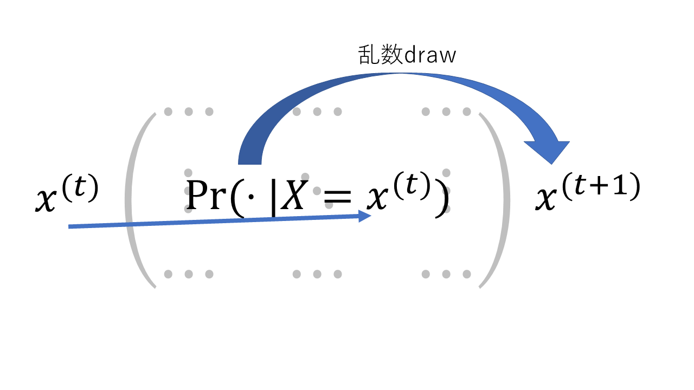
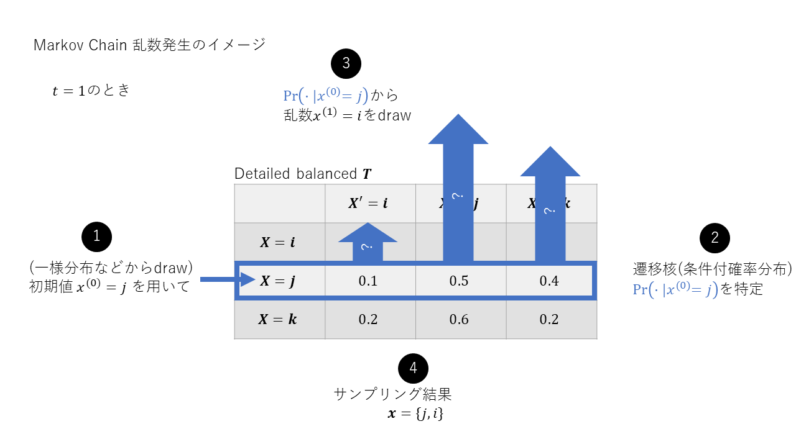
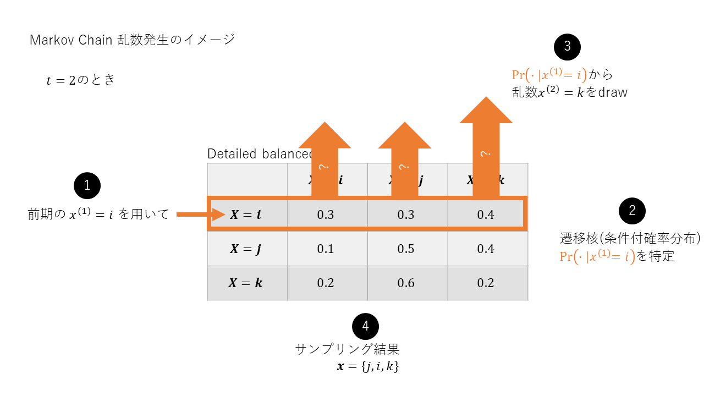
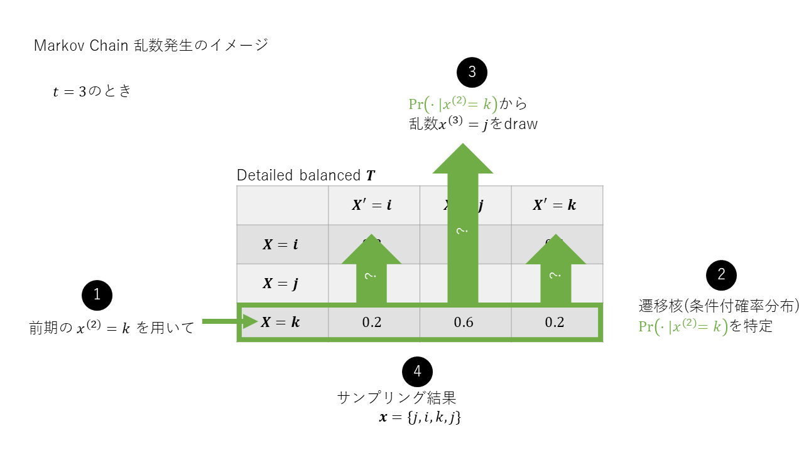
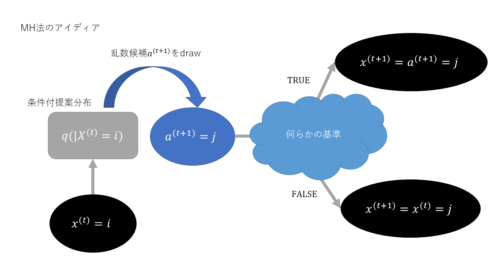
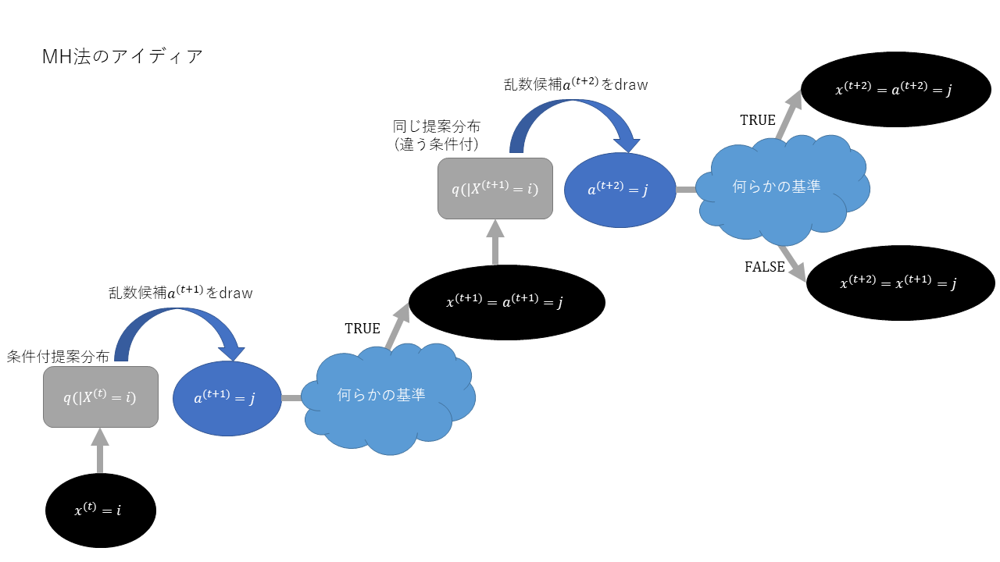
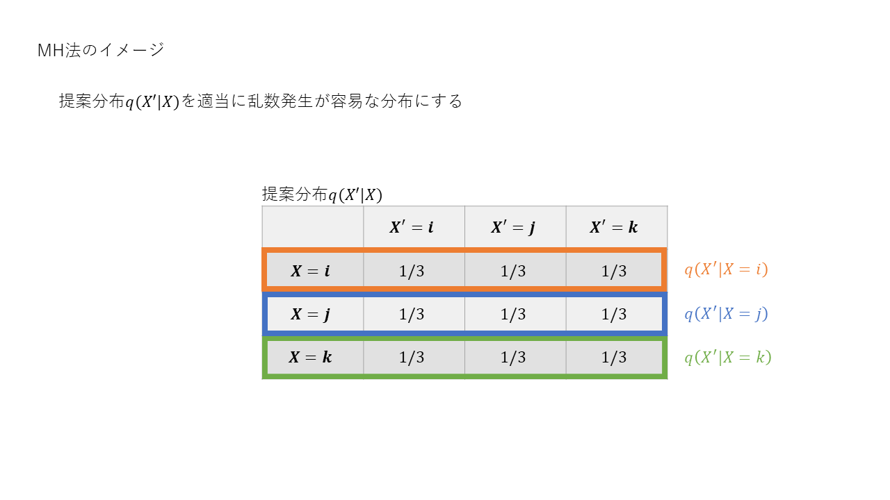
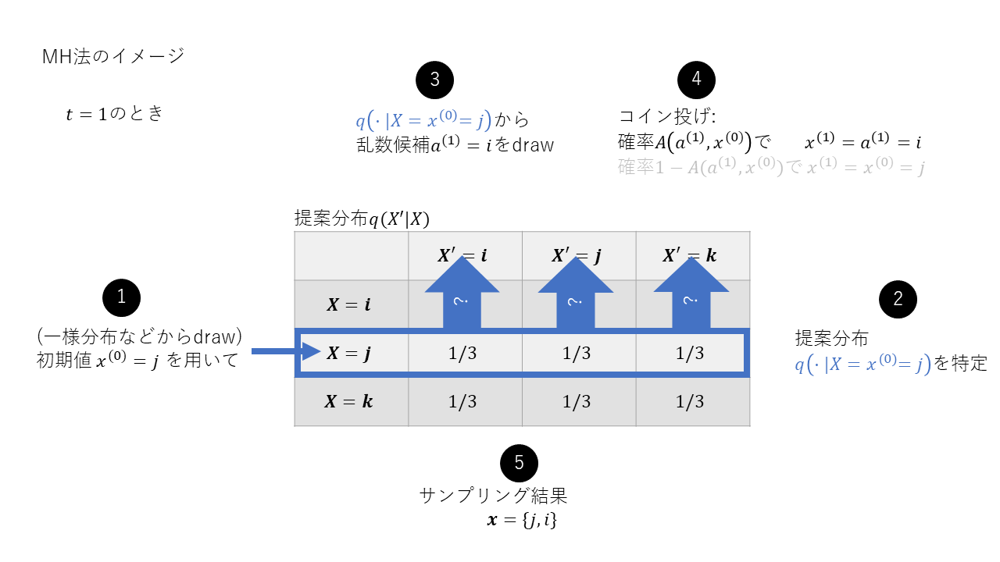
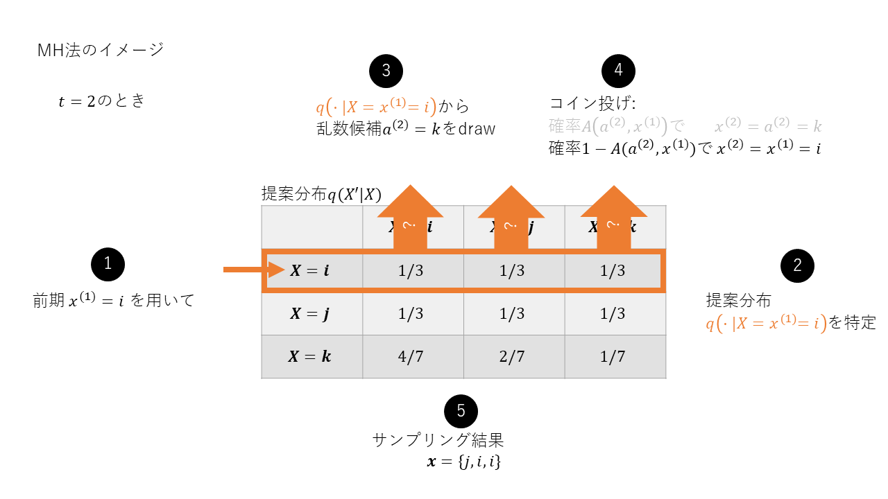
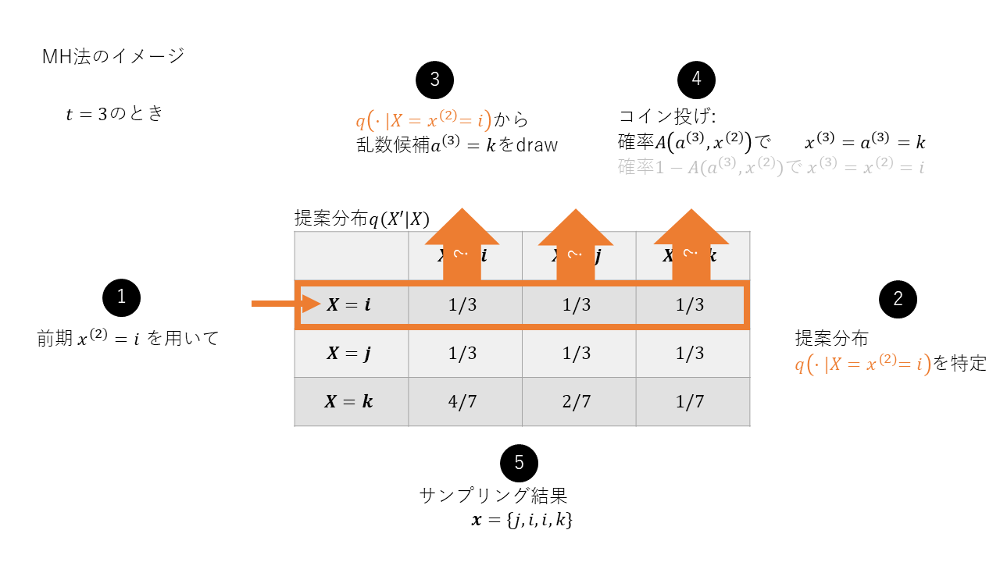

---
# https://rmarkdown.rstudio.com/lesson-11.html
title: "メトロポリス・ヘイスティングス法"
author: ""
date: "6/4/2021"
output: 
#  powerpoint_presentation:
  ioslides_presentation:
    widescreen: true
    smaller: true
---

```{r setup, include=FALSE}
knitr::opts_chunk$set(echo = FALSE)
library(dplyr)
library(ggplot2)
library(reshape2)
```

## マルコフ連鎖: 定常分布への収束

**遷移行列$\bf T$を知っている状態で, どんな定常分布$p(\cdot)$に収束するのか求めたい. **

---

遷移行列

$$\begin{eqnarray}
{\bf T} &=& 
  \left(
    \begin{array}{ccc}
      p(X^{(t+1)}=紋|X^{(t)}=紋) & p(X^{(t+1)}=紋|X^{(t)}=縞) & p(X^{(t+1)}=紋|X^{(t)}=玉) \\
      p(X^{(t+1)}=縞|X^{(t)}=紋) & p(X^{(t+1)}=縞|X^{(t)}=縞) & p(X^{(t+1)}=縞|X^{(t)}=玉) \\
      p(X^{(t+1)}=玉|X^{(t)}=紋) & p(X^{(t+1)}=玉|X^{(t)}=縞) & p(X^{(t+1)}=玉|X^{(t)}=玉) \\
    \end{array}
  \right) \\
\end{eqnarray}$$

---

マルコフ連鎖

$$\begin{eqnarray}
{\bf p^{(1)}} &=& \left(
    \begin{array}{ccc}
      p(X^{(1)}=紋) & p(X^{(1)}=縞) & p(X^{(1)}=玉)
    \end{array}
  \right) \\ 
{\bf p^{(2)}} &=& {\bf p^{(1)}}{\bf T} \\
{\bf p^{(t+1)}} &=& {\bf p^{(t)}}{\bf T} \\
\end{eqnarray}$$

---

要素ごとにみると

$$\begin{eqnarray}
  {\bf p^{(t+1)}} &=& {\bf p^{(t)}}{\bf T} \\
  p(X^{(t+1)}=紋) &=&  
  p(X^{(t+1)}=紋|X^{(t)}=紋)p(X^{(t)}=紋) + \\
  && p(X^{(t+1)}=紋|X^{(t)}=縞)p(X^{(t)}=縞) + \\
  && p(X^{(t+1)}=紋|X^{(t)}=玉)p(X^{(t)}=玉) \\
  p(X^{(t+1)}=j) &=& \sum_{i=1}^{3}p(X^{(t+1)}=j|X^{(t)}=i)p(X^{(t)}=i)
\end{eqnarray}$$

---

数値例: 

$$\begin{eqnarray}
{\bf T} &=& \left(
    \begin{array}{ccc}
      0.3 & 0.3 & 0.4 \\
      0.1 & 0.5 & 0.4 \\
      0.2 & 0.6 & 0.2
    \end{array}
  \right) \\
{\bf p^{(1)}} &=& \left(
    \begin{array}{ccc}
      0.6 & 0.25 & 0.15
    \end{array}
  \right) \\
\end{eqnarray}$$

---

```{r Markov-Chain-transition} 
# 期間
t <- 10

#表4.2　遷移核
A <- matrix(c(0.3, 0.3, 0.4,
              0.1, 0.5, 0.4,
              0.2, 0.6, 0.2
              ),
            nrow = 3, ncol = 3, byrow = TRUE
            )
rownames(A) <- c("紋","縞","玉")
colnames(A) <- c("紋","縞","玉")
# print(A)

# 空の行列
P <- matrix(0, t, 3)
# 初期状態の確率分布
p1 <- matrix(c(0.6, 0.25, 0.15), 1, 3)

# マルコフ連鎖
iter <- matrix(0, t, 1)
p <- P[1,] <- p1

for(i in 2:t){
  p <- P[i,] <- p %*% A 
}

df <- P %>% data.frame()
colnames(df) <- c("紋", "縞", "玉")
df["t"] <- df %>% row.names()

df
```

---

```{r Markov-Chain-transition-plot} 
temp <- melt(df,
             id="t",
             measure=c("紋", "縞", "玉"))

fig1 <- temp %>% ggplot(aes(x = t, 
                    y = value,
                    color = variable,
                    group = variable)) +
  geom_point() + 
  geom_line() + 
  xlab("期間") + 
  ylab("確率") + 
  ylim(0, 1) +
  ggtitle("マルコフ連鎖 確率分布の推移")

fig1
```

---

```{r Markov-Chain-stational-distribution-plot}
barplot(df[length(df), 1:3] %>% as.numeric(), names.arg = colnames(df)[1:3], ylim = c(0, 1))
```

定常分布は${\bf \bar p} = (\bar p(X=紋), \bar p(X=縞), \bar p(X=玉)) = (\frac{1}{6}, \frac{1}{2}, \frac{1}{3})$くらいですね. 

## マルコフ連鎖: 詳細釣り合い条件

**収束する先である定常分布$\bar p(\cdot)$を知っている状態で, どんな推移行列$\bf T$かを求めたい. **  
**($\bf T$がわかれば, $\bar p(\cdot)$に従う乱数が作れる!)**

---

定常分布$\bar p(\cdot)$に収束している状態を数式で表すと, 

$$\begin{eqnarray}
  \bar p(X'=j) &=& \sum_i {\rm Pr}(X'=j|X=i)\bar p(X=i) \ {\rm for \ all} \ j \\
  (\bar p(X=i) &=& \sum_j {\rm Pr}(X=i|X'=j)\bar p(X'=j) \ {\rm for \ all} \ i) \\
  なじみのある行列で書くと, \\
  {\bf p^{(\infty)}} &=& {\bf p^{(\infty)}}{\bf T} \\
\end{eqnarray}$$

---

$$\begin{eqnarray}
  \overbrace{\bar p(X'=j)}^{確率分布\bar p(・)は一定} &=& \overbrace {\sum_i {\rm Pr}(X'=j|X=i)}^{未知の遷移核}\overbrace{\bar p(X=i)}^{確率分布\bar p(・)は一定} {\rm for \ all} \ j \\
  行列で表すと \\
  \overset{確率分布一定}{{\bf \bar p}} &=& \overset{確率分布一定}{{\bf \bar p}} \overset{未知の遷移行列}{{\bf T}}
\end{eqnarray}$$

---

マルコフ過程が収束するための十分条件は,

$$\begin{eqnarray}
  {\rm Pr}(X=i|X'=j)\bar p(X'=j) &=& {\rm Pr}(X'=j|X=i)\bar p(X=i) \\
\end{eqnarray}$$

これを**詳細釣り合い条件**といいます. 

証明は以下の通りです. 

$$\begin{eqnarray}
  {\rm Pr}(X=i|X'=j)\bar p(X'=j) &=& {\rm Pr}(X'=j|X=i)\bar p(X=i) \\
  両辺をiに関して和をとる \\
  \sum_i {\rm Pr}(X=i|X'=j)\bar p(X'=j) &=& \sum_i {\rm Pr}(X'=j|X=i)\bar p(X=i) \\
  \bar p(X'=j)\overbrace {\sum_i {\rm Pr}(X=i|X'=j)}^{周辺化して1} &=& \sum_i {\rm Pr}(X'=j|X=i)\bar p(X=i) \\
  \bar p(X'=j) &=& \sum_i {\rm Pr}(X'=j|X=i)\bar p(X=i) \\
\end{eqnarray}$$

---

詳細釣り合い条件の意味は, 収束中1ステップあたりの  
「今期$X=i$ &rarr; 1期後$X'=j$に遷移する量$p(X'=j|X=i)p(X=i)$」と  「1期前$X'=j$ &rarr; 今期$X=i$に遷移する量$p(X=i|X'=j)p(X'=j)$」が等しい

$$\begin{eqnarray}
  \overbrace{{\rm Pr}(X=i|X'=j)\bar p(X'=j)}^{j \rightarrow i の移動量} &=& \overbrace{{\rm Pr}(X'=j|X=i)\bar p(X=i)}^{i \rightarrow j の移動量} \\
\end{eqnarray}$$

---

```{r meaning-of-detailed-balance-condition}
barplot(df[length(df), 1:3] %>% as.numeric(), names.arg = colnames(df)[1:3], ylim = c(0, 1))
text(1.9,0.59,"p(縞)",cex=1.0)
text(3.1,0.4,"p(玉)",cex=1.0)
add <- 0.1
arrows(3.25,0.08,2.2,0.38,lty=1,lwd=1.8)
arrows(2.2,0.38+add,3.25,0.08+add,lty=1,lwd=1.8)
text(2.70,0.15,"p(玉|縞)",cex=1.0)
text(2.70,0.45,"p(縞|玉)",cex=1.0)
```

## マルコフ連鎖: 定常分布の乱数発生

* 各要素が詳細釣り合い条件${\rm Pr}(X=i|X'=j)\bar p(X'=j) = {\rm Pr}(X'=j|X=i)\bar p(X=i)$  
  を満たす遷移核である遷移行列$\bf A$を発見する.
* $x^{(t)}$を遷移行列${\bf T}$にくぐらせる(条件付確率分布${\rm Pr}(\cdot|X=x^{(t)})$から乱数発生する)と   
  定常分布$\bar p(\cdot)$に従った$x^{(t+1)}$が出てくる. (初期値は定義域なら何でもok)  
* 更に$x^{(t+1)}$を遷移行列${\bf T}$にくぐらせると...というふうに繰り返すと,          
  定常分布$\bar p(\cdot)$に従った状態が乱数列${\bf x} = \{x_0, x_1, ...\}$が得られる.  



---



---



---



---

<例題>

定常分布は${\bf \bar p} = (\frac{1}{6}, \frac{1}{2}, \frac{1}{3})$でした. 定常分布を元に詳細釣り合い条件を満たす遷移核を何とかして見つけておきました. 確かめてみてください. 

|  | 紋 | 縞 | 玉 |
| :---: | :---: | :---: | :---: |
| 紋 | 0.3 | 0.3 | 0.4 |
| 縞 | 0.1 | 0.5 | 0.4 |
| 玉 | 0.2 | 0.6 | 0.2 |

この遷移核を用いて, 定常分布に従う乱数を作ってみましょう. 

---

```{r RNG with detailed balance condition}
# 退場分布を知っている状態で
# 詳細釣り合い条件を満たす遷移核も仮にわかっているなら
# 定常分布に従う乱数は簡単に作れる

set.seed(0)

p_bar = c(1/6, 1/2, 1/3) # 目的分布 (定常分布)
Tr <- matrix(c(0.3, 0.3, 0.4, 0.1, 0.5, 0.4, 0.2, 0.6, 0.2), nrow = 3, ncol = 3, byrow = TRUE) # 提案分布 (遷移核)

x <- c()
accept <- 0

# 初期値設定
x_0 <- sample(x = c(1, 2, 3), # 1: 紋, 2: 縞, 3: 玉
             size = 1,
             replace = TRUE,
             prob = c(1/3, 1/3, 1/3) # 初期値は適当でいいよね?
             )

x <- x %>% append(x_0)

for (i in 1:10000) {
  # 1期前の値を基に提案分布P( |t-1)を特定し, 提案分布から乱数発生
  if (x[length(x)] == 1) {
    x_t <- sample(x = c(1, 2, 3), # 1: 紋, 2: 縞, 3: 玉
                  size = 1,
                  replace = TRUE,
                  prob = Tr[1, ]  # P( |紋) # 完璧な提案分布
                  )
  } else if (x[length(x)] == 2) {
    x_t <- sample(x = c(1, 2, 3), # 1: 紋, 2: 縞, 3: 玉
                  size = 1,
                  replace = TRUE,
                  prob = Tr[2, ]  # P( |縞) # 完璧な提案分布
                  )
  } else {
    x_t <- sample(x = c(1, 2, 3), # 1: 紋, 2: 縞, 3: 玉
                  size = 1,
                  replace = TRUE,
                  prob = Tr[3, ]  # P( |玉) # 完璧な提案分布
                  )
  }
  # 詳細釣り合い条件の判定(満たしていなかったらrejectするか, もったいないなら確率補正して採用)
  if (near(Tr[x[length(x)], x_t] * p_bar[x[length(x)]], Tr[x_t, x[length(x)]] * p_bar[x_t], tol=0.01)) { 
    # 詳細釣り合い条件満たすかどうか(満たしている遷移核使ってるから満たすに決まってる)
    x <- x %>% append(x_t)
    accept <- accept + 1
  } else {
    # 仮に満たしていないのであれば確率補正する
    print("確率補正する. ")
  }
}

# acceptance_rate = accept / 10000
# acceptance_rate

# 発生した乱数
print("Generated Random Numbers")
x

# simulated stationary distribution
# 完璧な提案分布に従う乱数を発生させたら, 目的分布に従う乱数となる. p(|)もp()も一緒だしな. 
p_rand <- c((x==1) %>% mean(), (x==2) %>% mean(), (x==3) %>% mean())
```

---

```{r}
# plot distribution
barplot(rbind(p_rand, p_bar), beside = TRUE, names.arg = c("紋", "縞", "玉"), ylim = c(0, 1), legend = TRUE)
```

---

詳細釣り合い条件を満たしている遷移行列${\bf T}$がわからない状態で,  
どうやって定常分布にしたがう乱数を発生したらいいでしょうか?

$$\begin{eqnarray}
  \overbrace{{\rm Pr}(X=i|X'=j)}^{?}\bar p(X'=j) &=& \overbrace{{\rm Pr}(X'=j|X=i)}^{?}\bar p(X=i) \\
\end{eqnarray}$$

## メトロポリス・ヘイスティングス法 (Metropolis-Hastings: MH))

遷移核${\rm Pr}(|X=i)$からdrawする代わりに,  
適当な乱数生成が容易な分布(**提案分布**)$q(|X=i)$から  
乱数候補$a^{(t+1)}$をdrawします.  
(遷移核も, 行列$A$の各行で切ってみると条件付確率**分布**です)  

drawした乱数候補$a^{(t+1)}$について, "ある基準"を満たせば採用し,  
満たさなければ破棄(マルコフ連鎖なので前の状態を維持)します.   

そうやって採用と破棄を繰り返せば, 定常分布(**目的分布**)に従う乱数が作れそうです.   

これがMH法のざっくりしたアイディアとなります. 

---



---



---

もっと正確にいうと,  

drawした乱数候補$a^{(t+1)}$について, "ある基準"に基づいて, (マルコフ連鎖は確率的遷移なので)一定確率$A$で採用し, 一定確率$1-A$で前の状態を維持します.   

このように,もとの遷移にさらに確率的な要素を加えて補正することを確率補正といいます.  

---

それでは, MH法のポイントである"ある基準"が何なのか見てみましょう.  

"ある基準"とは, 「詳細釣り合い条件が成り立つ」かどうかです.  
(遷移に詳細釣り合い条件さえ成り立てば目的の定常分布に収束するので乱数を好きなだけ作れます)

そこで詳細釣り合い条件が成り立つように以下の確率$A(a^{(t+1)}, X^{(t)})$で提案分布を確率補正します. 


$$\begin{eqnarray}
  A(a^{(t+1)}, X^{(t)}) &=& \min \left(1, \frac {q(X^{(t)}|a^{(t+1)}) \bar p(a^{(t+1)})} {q(a^{(t+1)}|X^{(t)}) \bar p(X^{(t)})} \right) \\
\end{eqnarray}$$

---

確率$A(a^{(t+1)}, X^{(t)})$ !順番注意! を提案分布$q(a^{(t+1)} | X^{(t)})$と組み合わせて確率補正すると,  
補正された遷移核$q(a^{(t+1)} | X^{(t)}) \ A(a^{(t+1)}, X^{(t)})$は詳細釣り合い条件を満たします.  
従って確率補正した遷移は目的の定常分布に収束します.  

<証明>  

$$\begin{eqnarray}
  q(a^{(t+1)} | X^{(t)}) \ A(a^{(t+1)}, X^{(t)}) \ \bar p(X^{(t)}) 
  &=& q(a^{(t+1)} | X^{(t)}) \ \min \left(1, \frac {q(X^{(t)}|a^{(t+1)}) \bar p(a^{(t+1)})} {q(a^{(t+1)}|X^{(t)}) \bar p(X^{(t)})} \right) \bar p(X^{(t)}) \\
  &=& \ \min \left( \ q(a^{(t+1)} \bar p(X^{(t)}) | X^{(t)}), \ q(X^{(t)}|a^{(t+1)}) \bar p(a^{(t+1)}) \ \right) \\
  &=& \ q(X^{(t)}|a^{(t+1)}) \min \left( \ \frac {q(a^{(t+1)} \bar p(X^{(t)}) | X^{(t)})} {q(X^{(t)}|a^{(t+1)}) \bar p(a^{(t+1)})}, \ 1 \ \right) \bar p(a^{(t+1)}) \\
  &=& \ q(X^{(t)}|a^{(t+1)}) \ A(X^{(t)}, a^{(t+1)}) \ \bar p(a^{(t+1)})
\end{eqnarray}$$

時点の前後は一般的には関係ないので, $a^{(t+1)}=X', X^{(t)}=X$とすると,

$$\begin{eqnarray}
  q(X' | X) \ A(X', X) \ \bar p(X) 
  &=& \ q(X|X') \ A(X, X') \ \bar p(X')
\end{eqnarray}$$

---



---



---



---



---

<例題>
定常分布は${\bf \bar p} = (\frac{1}{6}, \frac{1}{2}, \frac{1}{3})$でした. 詳細釣り合い条件を満たす遷移核はわかりません. 
なので適当に提案分布を一様分布にしてみます.

* 提案分布

|  | 紋 | 縞 | 玉 |
| :---: | :---: | :---: | :---: |
| 紋 | 1/3 | 1/3 | 1/3 |
| 縞 | 1/3 | 1/3 | 1/3 |
| 玉 | 1/3 | 1/3 | 1/3 |

MH法で定常分布${\bf \bar p}$に従う乱数を発生させてみましょう


---

```{r discrete simplified MH}
# Generating random number with transition matrix which satisfies detailed balance condition
# 離散 MH
set.seed(0)

p_bar = c(1/6, 1/2, 1/3) # 目的分布 (定常分布)
# A <- matrix(c(0.3, 0.3, 0.4, 0.1, 0.5, 0.4, 0.2, 0.6, 0.2), nrow = 3, ncol = 3, byrow = TRUE) # 提案分布 (遷移核)

Bin <- 10000        #バーンイン期間
Nsim <- 100000 + Bin     #シミュレーションサイズ
x <- numeric(Nsim)
accept <- 0

# 提案分布: 簡単な一様分布 (ちなみに詳細つり合い条件は満たしていない)
Tr <- matrix(c(1/3, 1/3, 1/3, 1/3, 1/3, 1/3, 1/3, 1/3, 1/3), nrow = 3, ncol = 3, byrow = TRUE)
# こっちは全然うまく収束しない
# Tr <- matrix(c(1/5, 3/5, 1/5, 1/5, 3/5, 1/5, 1/5, 3/5, 1/5), nrow = 3, ncol = 3, byrow = TRUE)

start_time <- Sys.time()

# 初期値設定
x_0 <- sample(x = c(1, 2, 3), # 1: 紋, 2: 縞, 3: 玉
             size = 1,
             replace = TRUE,
             prob = c(1/3, 1/3, 1/3) # 初期値は適当でいいよね?一様分布ではあるけど. 
             )

x[1] <- x_0

for (t in 2:Nsim) {
  # cat("t = ")
  # print(t)
  # 1期前の値を基に提案分布P( |t-1)を特定し, 提案分布から乱数発生
  if (x[t-1] == 1) {
    a_t <- sample(x = c(1, 2, 3), # 1: 紋, 2: 縞, 3: 玉
                  size = 1,
                  replace = TRUE,
                  prob = Tr[1, ]  # P( |紋) # 条件付提案分布: 一様分布
                  )
  } else if (x[t-1] == 2) {
    a_t <- sample(x = c(1, 2, 3), # 1: 紋, 2: 縞, 3: 玉
                  size = 1,
                  replace = TRUE,
                  prob = Tr[2, ]  # P( |縞) # 条件付提案分布: 一様分布
                  )
  } else {
    a_t <- sample(x = c(1, 2, 3), # 1: 紋, 2: 縞, 3: 玉
                  size = 1,
                  replace = TRUE,
                  prob = Tr[3, ]  # P( |玉) # 条件付提案分布: 一様分布
                  )
  }
  # 補正確率 r の計算
  r <- (Tr[x[t-1], a_t] * p_bar[a_t]) / (Tr[a_t, x[t-1]] * p_bar[x[t-1]])
  if (runif(1) < r) { 
    # 本当はmin(1, r)だけど, 1 > rのとき (runif(1) < r) == TRUEだから
    # わざわざr'の部分は書かなくてもいい(理論上は補正確率が1以上でおかしいけど)
     x[t] <- a_t
     accept <- accept + 1
  } else {
     x[t] <- x[t-1]
  }
}

acceptance_rate <- accept / Nsim
print("acceptance rate")
acceptance_rate

end_time <- Sys.time()
print("Run Time")
# 簡略化アルゴリズムが遅いのは, 不等号<のときでも無駄にr(>1)を計算しているからかも?
# rを変数定義しなければ早いかも(--> それでも遅い)
print(end_time - start_time)

# simulated stationary distribution
# バーンイン除く
p_sim <- c((x[(Bin+1):Nsim]==1) %>% mean(),
           (x[(Bin+1):Nsim]==2) %>% mean(),
           (x[(Bin+1):Nsim]==3) %>% mean())

print("sampled distribution")
p_sim

# true stational distribution
print("invariant distribution")
p_bar
```

---

```{r discrete simplified MH trace plot head}
# trace plot
trplot_len <-  100

df <- data.frame(x)
df["t"] <- df %>% rownames

plot(df[1:trplot_len, ]$t, df[1:trplot_len, ]$x, xlab = "t", ylab = "x^(t)", 
     main = "トレースプロット: t=0~100", sub = "バーンイン")
par(new=T)
plot(df[1:trplot_len, ]$t, df[1:trplot_len, ]$x, xlab = "t", ylab = "x^(t)", type = "S")
```

---

```{r discrete simplified MH trace plot tail}
plot(df[(nrow(df)-trplot_len):nrow(df), ]$t, df[(nrow(df)-trplot_len):nrow(df), ]$x, xlab = "t", ylab = "x^(t)",
     main = "トレースプロット: t=99900~100000")
par(new=T)
plot(df[(nrow(df)-trplot_len):nrow(df), ]$t, df[(nrow(df)-trplot_len):nrow(df), ]$x, xlab = "t", ylab = "x^(t)", type = "S")
```

---

```{r discrete simplified MH trace plot all}
options(width=20, height=20)
plot(df$t, df$x, ylab='x^(t)',xlab='t', lwd=0.5,
     col = rgb(red = 0, green = 0, blue = 0, alpha = 0.009),
     main="トレースプロット", sub="バーンイン期間1000")
```

---

```{r discrete simplified MH dist plot}
# plot distribution
barplot(rbind(p_sim, p_bar), beside = TRUE, names.arg = c("紋", "縞", "玉"), ylim = c(0, 1), legend = TRUE)
```

## 離散から連続へ

<!-- 先の離散の例では確率変数のとりうる値は$\{紋, 縞, 玉\}$の3つのみでした. 初期値の心配は特にしていません.    -->
<!-- 一方, 連続の場合, 取りうる範囲は$(-\infty, \infty)$です. 初期値のとり方によって収束先が毎回異なってしまうと困ります.    -->
<!-- どんな初期値をとっても, ステップを無限にとれば同じ定常分布に収束するような特性をergodicityといい, この時の定常分布を特にequilibrium distributionといいます.    -->
<!-- 連続であってもMH法がergodicityを持つことを確認してみましょう -->

これまでは離散の例で, 確率変数$X$のとりうる値は$\{紋, 縞, 玉\}$の3つのみでした.  
私たちの目的は事後分布$f(\theta|D)$に従う連続の確率変数$\theta$(範囲は$(-\infty, \infty)$)の乱数を発生させることです.  
離散を連続に置き換えていきましょう.  

* 定常分布

$$
  \bar p(X) \rightarrow f(\theta|D)
$$ 

* 提案分布

$$
  q(a^{(t+1)}|X^{(t)}) \rightarrow q(a^{(t+1)}|\theta^{(t)})
$$

---

* 補正確率

$$\begin{eqnarray}
  A(a^{(t+1)}, X^{(t)}) &=& \min \left(1, \frac {q(X^{(t)}|a^{(t+1)}) \bar p(a^{(t+1)})} {q(a^{(t+1)}|X^{(t)}) \bar p(X^{(t)})} \right) \\
  &\downarrow& \\
  A(a^{(t+1)}, \theta^{(t)}) &=& \min \left(1, \frac {q(\theta^{(t)}|a^{(t+1)}) f(a^{(t+1)}|D)} 
  {q(a^{(t+1)}|\theta^{(t)}) f(\theta^{(t)}|D)} \right) \\
  &=& \min \left(1, \frac {q(\theta^{(t)}|a^{(t+1)}) \frac{f(D|a^{(t+1)})f(a^{(t+1)})}{f(D)} } 
  {q(a^{(t+1)}|\theta^{(t)}) \frac{f(D|\theta^{(t)})f(\theta^{(t)})}{f(D)} } \right) \\
  &=& \min \left(1, \frac {q(\theta^{(t)}|a^{(t+1)}) f(D|a^{(t+1)})f(a^{(t+1)}) } 
  {q(a^{(t+1)}|\theta^{(t)}) f(D|\theta^{(t)})f(\theta^{(t)}) } \right) \\
\end{eqnarray}$$

## MH法の特殊形

今まで一般的なMH法を紹介してきましたが, ここからはMH法の特殊形(よりシンプル)を紹介します.

## 独立メトロポリス・ヘイスティングス法 (Independence Metropolis-Hastings: IMH)

一般的なMH法の提案分布は条件付きでした. $q(\cdot|\theta^{(t)})$  
IMH法は提案分布を1期前の乱数に依存しない無条件分布$q(\cdot)$とします.   そうすると各ステップでdrawされる乱数の候補が互いに独立($i.i.d$)になります.  

補正確率は以下のようになります

$$\begin{eqnarray}
  A(a^{(t+1)}, \theta^{(t)}) &=& \min \left(1, \frac {q(\theta^{(t)}) f(a^{(t+1)}|D)} 
  {q(a^{(t+1)}) f(\theta^{(t)}|D)} \right) \\
\end{eqnarray}$$

---

<例題>

ポアソン分布のパラメータ(期待値)を推定します. ポアソン分布の尤度にガンマ分布の事前分布をかけて事後分布が$f(\theta|\alpha=11,\lambda=13)$のガンマ分布となりました. これに従う乱数をIMHで発生してみましょう.   
(ガンマ分布なら期待値と分散は解析的に求まっているのでわざわざMH法使わなくてもいけるのですが教材としてやってみます)

目的分布である事後カーネルは, 

$$
f(D|\theta)f(\theta) = e^{-13\theta}\theta^{10}
$$

提案分布$q(\theta)$は何でもいいですが, 簡単な正規分布${\rm Normal}(1, 0.5)$にしてみます. (実際ここの調整が難しいのですが)

---

```{r IMH exercise}
qme <- 1.0         #提案分布の期待値
qsd <- sqrt(0.5)   #提案分布のＳＤ
Nsi <- 10^5        #サンプルサイズ
Bin <- 10^3        #バーンイン期間

imh <- function(qme, qsd, Nsi, Bin) {
  set.seed(1)
  theta <- numeric(Nsi) # 採用した乱数のベクトル
  theta[1] <- rnorm(1, mean=qme, sd=qsd) # 初期値(もちろん提案分布からサンプリング)
  co <- 0 # カウント
  
  start_time <- Sys.time()
  for (t in 2:Nsi) {
      a <- rnorm(1, mean=qme, sd=qsd) # 乱数候補の生成
      r <- ((dnorm(theta[t-1], mean=qme, sd=qsd)*dgamma(a,shape=11,rate=13)) / 
            (dnorm(a, mean=qme, sd=qsd)*dgamma(theta[t-1],shape=11,rate=13))) # 補正確率
      if (runif(1) < r) { 
         theta[t] <- a
         co <- co + 1
      } else {
         theta[t] <- theta[t-1]
      }
  }
  end_time <- Sys.time()
  # print("Run Time")
  # print(end_time - start_time)
  cat("採択率")
  print(co/Nsi)
  
  return (theta)
}

print_result <- function(theta) {
  # MCMC結果
  cat("モンテカルロ積分\n")
  cat("Mean")
  round(mean(theta[(Bin+1):Nsi]), 3) %>% print() # バーンイン期間切り捨て
  cat("Var")
  round(var( theta[(Bin+1):Nsi]), 3) %>% print()
  cat("SD")
  round(sd(  theta[(Bin+1):Nsi]), 3) %>% print()
}

trace_plot_head <- function(theta) {
  # トレースプロット
  df <- data.frame(theta)
  df["t"] <- df %>% rownames()
  trplot_len <- 2000
  
  plot(df[1:trplot_len, ]$t, df[1:trplot_len, ]$theta,
       type="l",ylim=c(0, 3),ylab='θ^(t)',xlab='t',lwd=0.5,
       main="乱数θ^(t)のトレースプロット",sub="バーンイン期間1000")
}

trace_plot_tail <- function(theta) {
  # トレースプロット
  df <- data.frame(theta)
  df["t"] <- df %>% rownames()
  trplot_len <- 2000
  
  plot(df[(nrow(df)-trplot_len):nrow(df), ]$t, df[(nrow(df)-trplot_len):nrow(df), ]$theta,
       type="l",ylab='θ^(t)',xlab='t',lwd=0.5,ylim=c(0, 3),
       main="乱数θ^(t)のトレースプロット",sub="バーンイン期間1000")
}

trace_plot_all <- function(theta) {
  # トレースプロット
  df <- data.frame(theta)
  df["t"] <- df %>% rownames()
  
  plot(df$t, df$theta,
       type="l",ylab='θ^(t)',xlab='t',lwd=0.5,ylim=c(0, 3),
       main="乱数θ^(t)のトレースプロット",sub="バーンイン期間1000")
}

dist_plot <- function(theta) {
  # 目的分布とサンプリング結果のプロット
  hist(theta, breaks =50, xlab='', xlim=c(0,2.5), ylim=c(0,2.0), freq=F, 
       main="事後分布(青線)とサンプリング結果(ヒストグラム)")
  par(new=T)
  curve(dgamma(x,shape=11,rate=13),0,2.5,ylab='',xlab='θ, θ^(t)',xlim=c(0,2.5),ylim=c(0,2.0),lwd=2.0,col="blue")
}

# 解析解
print_analytical_solution <- function() {
  cat("解析解\n")
  cat("Mean")
  round(11/13, 3) %>% print()
  cat("Var")
  round(11/13^2, 3) %>% print()
  cat("SD")
  round(sqrt(11/13^2), 3) %>% print()
}
print_analytical_solution()

result <- imh(qme, qsd, Nsi, Bin)

print_result(result)
```

---

```{r}
trace_plot_head(result)
```

---

```{r}
trace_plot_tail(result)
```

---

```{r}
trace_plot_all(result)
```

---

```{r}
dist_plot(result)
```

## IMH法の弱点

上の例では提案分布を${\rm Normal}(1, 0.5)$としてみました. 結果的には良いMCMCサンプリングができと言えます. その理由は, 目的分布である事後分布${\rm Gamma}(\alpha=11, \lambda=13)$と結構重なっていたからです. 

```{r posterior (target) and proposal distribution, echo=FALSE}
curve(dgamma(x,11,13),-1,4,ylab='density',xlab='θ, θ^(t)',lwd=2.0,add=F, main="事後分布と提案分布", col="blue")
curve(dnorm(x,1.0,sqrt(0.5)),-1,4,ylab='',xlab='',lwd=2.0,add=T)
text(0.25,1.5,'G(11,13)',col="blue")
text(0,0.4,'N(1,0.5)')
```

---

提案分布の期待値と分散を変えるとどうなるでしょう. 

```{r posterior (target) and several proposal distribution, echo=FALSE}
curve(dgamma(x,11,13),-1,4,ylab='density',xlab='θ, θ^(t)',lwd=2.0,add=F, main="事後分布といろいろな提案分布", col="blue")
curve(dnorm(x,1.0,sqrt(0.5)),-1,4,ylab='',xlab='',lwd=2.0,add=T)
curve(dnorm(x,3.0,sqrt(0.5)),-1,4,ylab='',xlab='',lwd=1.5,lty=2,add=T)
curve(dnorm(x,1.0,sqrt(10)),-1,4,ylab='',xlab='',lwd=1.5,lty=2,add=T)
curve(dnorm(x,2.0,sqrt(0.01)),-1,4,ylab='',xlab='',lwd=1.5,lty=2,add=T)
text(0.25,1.5,'G(11,13)',col="blue")
text(0,0.4,'N(1,0.5)')
text(3,0.65,'N(3,0.5)')
text(3,0.2,'N(1,10)')
text(2.5,1.0,'N(2,0.01)')
```

---

```{r }
curve(dgamma(x,11,13),-1,4,ylab='density',xlab='θ, θ^(t)',lwd=2.0,add=F, main="事後分布といろいろな提案分布", col="blue")
#curve(dnorm(x,1.0,sqrt(0.5)),-1,4,ylab='',xlab='',lwd=2.0,add=T)
#curve(dnorm(x,3.0,sqrt(0.5)),-1,4,ylab='',xlab='',lwd=1.5,lty=2,add=T)
curve(dnorm(x,1.0,sqrt(10)),-1,4,ylab='',xlab='',lwd=1.5,lty=2,add=T)
#curve(dnorm(x,2.0,sqrt(0.01)),-1,4,ylab='',xlab='',lwd=1.5,lty=2,add=T)
text(0.25,1.5,'G(11,13)',col="blue")
#text(0,0.4,'N(1,0.5)')
#text(3,0.65,'N(3,0.5)')
text(3,0.2,'N(1,10)')
#text(2.5,1.0,'N(2,0.01)')
```

---

```{r }
# 提案分布N(1, 10)
print_analytical_solution()
print("proposal: N(1, 10)")
qme <- 1.0         #提案分布の期待値
qsd <- sqrt(10)   #提案分布のＳＤ
Nsi <- 10^5        #サンプルサイズ
Bin <- 10^3        #バーンイン期間
result <- imh(qme, qsd, Nsi, Bin)

print_result(result)
```

---

```{r}
trace_plot_head(result)
```

---

```{r}
trace_plot_tail(result)
```

---

```{r}
trace_plot_all(result)
```

---

```{r}
dist_plot(result)
```

---

```{r }
curve(dgamma(x,11,13),-1,4,ylab='density',xlab='θ, θ^(t)',lwd=2.0,add=F, main="事後分布といろいろな提案分布", col="blue")
#curve(dnorm(x,1.0,sqrt(0.5)),-1,4,ylab='',xlab='',lwd=2.0,add=T)
curve(dnorm(x,3.0,sqrt(0.5)),-1,4,ylab='',xlab='',lwd=1.5,lty=2,add=T)
#curve(dnorm(x,1.0,sqrt(10)),-1,4,ylab='',xlab='',lwd=1.5,lty=2,add=T)
#curve(dnorm(x,2.0,sqrt(0.01)),-1,4,ylab='',xlab='',lwd=1.5,lty=2,add=T)
text(0.25,1.5,'G(11,13)',col="blue")
#text(0,0.4,'N(1,0.5)')
text(3,0.65,'N(3,0.5)')
#text(3,0.2,'N(1,10)')
#text(2.5,1.0,'N(2,0.01)')
```

---

```{r }
# 提案分布N(3, 0.5)
print_analytical_solution()
print("proposal: N(3, 0.5)")
qme <- 3.0        #提案分布の期待値
qsd <- sqrt(0.5)   #提案分布のＳＤ
Nsi <- 10^5        #サンプルサイズ
Bin <- 10^3        #バーンイン期間
result <- imh(qme, qsd, Nsi, Bin)

print_result(result)
```

---

```{r}
trace_plot_head(result)
```

---

```{r}
trace_plot_tail(result)
```

---

```{r}
trace_plot_all(result)
```

---

```{r}
dist_plot(result)
```

---

```{r }
curve(dgamma(x,11,13),-1,4,ylab='density',xlab='θ, θ^(t)',lwd=2.0,add=F, main="事後分布といろいろな提案分布", col="blue")
#curve(dnorm(x,1.0,sqrt(0.5)),-1,4,ylab='',xlab='',lwd=2.0,add=T)
#curve(dnorm(x,3.0,sqrt(0.5)),-1,4,ylab='',xlab='',lwd=1.5,lty=2,add=T)
#curve(dnorm(x,1.0,sqrt(10)),-1,4,ylab='',xlab='',lwd=1.5,lty=2,add=T)
curve(dnorm(x,2.0,sqrt(0.01)),-1,4,ylab='',xlab='',lwd=1.5,lty=2,add=T)
text(0.25,1.5,'G(11,13)',col="blue")
#text(0,0.4,'N(1,0.5)')
#text(3,0.65,'N(3,0.5)')
#text(3,0.2,'N(1,10)')
text(2.5,1.0,'N(2,0.01)')
```

---

```{r }
# 提案分布N(2, 0.01)
print_analytical_solution()
print("proposal: N(2, 0.01)")
qme <- 2.0         #提案分布の期待値
qsd <- sqrt(0.01)   #提案分布のＳＤ
Nsi <- 10^5        #サンプルサイズ
Bin <- 10^3        #バーンイン期間
result <- imh(qme, qsd, Nsi, Bin)

print_result(result)
```

---

```{r}
trace_plot_head(result)
```

---

```{r}
trace_plot_tail(result)
```

---

```{r}
trace_plot_all(result)
```

---

```{r}
dist_plot(result)
```

---

例えば提案分布が${\rm Normal}(1, 2)$だと, $\theta$の範囲はうまくカバーできてるものの事後分布と重なっている面積が小さいため受容率が低く収束も遅くなります. ${\rm Normal}(3, 0.5)$や${\rm Normal}(2, 0.01)$はそもそも重なっている面積がほぼないので絶望的です. 

仮に事後分布の位置や形がわかっていれば上手な提案分布を設定できるかもしれませんが,   実際の分析では事後分布の形を把握することが難しいので, 分析者がIMHの提案分布を設定するのは非常に困難です.   そこでランダムウォークMHを導入します. 

## ランダムウォーク メトロポリス・ヘイスティングス法 (Random Walk Metropolis-Hastings: RWMH)

RWMHはパラメータの乱数候補$a^{(t)}$を各ステップで提案分布$q(|)$から逐一drawするのではなく, 

$$
  a^{(t+1)} = \theta^{(t)} + e \\
  e \sim {\rm Normal}(0, \delta_e^2) \ {\rm or} \ {\rm Uniform}(-\delta_e', \delta_e')
$$

とします. $e$はノイズで, $E[e]=0$となるような左右対称な分布(平均0の正規分布や左右対称な一様分布)に従います.   すると$a^{(t+1)}$は1ステップ前の乱数$\theta^{(t)}$と平均0のノイズ$e$だけで決まるランダムウォークになります.  
ランダムウォークに動くということは, 仮に1ステップ前の乱数$\theta^{(t)}$が"良い"乱数であれば, 次の乱数候補$a^{(t+1)}$もそう悪くない乱数になるということです(期待値は1ステップ前の乱数$E[a^{(t+1)}]=\theta^{(t)}$).   これは当てずっぽうに毎ステップ同じ提案分布$q(\cdot)$から乱数候補をdrawするIMHよりも良さそうです. 

## RWMH法

RWMHの提案分布自体は正規分布や一様分布でなくても何でもいいですが, 対称な分布にすると便利です. 
対称な提案分布にすると, 

$$
  q(a^{(t+1)}|\theta^{(t)}) = q(\theta^{(t)}|a^{(t+1)})
$$

となります. よってRWMHの補正確率は

$$\begin{eqnarray}
  A(a^{(t+1)}, \theta^{(t)}) &=& \min \left(1, \frac {f(a^{(t+1)}|D)} 
  {f(\theta^{(t)}|D)} \right) \\
\end{eqnarray}$$

となり, 補正確率$r$から提案分布$q(|)$が消えて事後分布の比だけになります. あとはいつものMH法のようにサンプリングします. 

---

<例題>

先のIMHの例題をRWMHでやってみます. 初期値は$\theta^{(0)}=4$としてわざと遠くにしてみます.   
ノイズ$e$の分散は$\delta_e^2=0.1$とします(実際これは分析者が調節します). 

---

```{r RMH exercise}
qsd <- sqrt(0.1)   #提案分布のＳＤ
Nsi <- 10^5+100    #サンプルサイズ
Bin <- 10^2        #バーンイン期間

rwmh <- function(qme, qsd, Nsi, Bin) {
  set.seed(1)
  theta <- numeric(Nsi) # 採用した乱数のベクトル
  theta[1] <- 4 # 初期値: でたらめでオッケー
  co <- 0 # カウント
  
  start_time <- Sys.time()
  for (t in 2:Nsi){
      a <- rnorm(1, mean=theta[t-1], sd=qsd) # 乱数候補をランダムウォークで生成
      r <- (dgamma(a,shape=11,rate=13) / 
            dgamma(theta[t-1],shape=11,rate=13)) # 補正確率: 提案分布は消える
      if (runif(1) < r) { 
         theta[t] <- a
         co <- co + 1
      } else {
         theta[t] <- theta[t-1]
      }
  }
  end_time <- Sys.time()
  # print("Run Time")
  # print(end_time - start_time)
  cat("採択率")
  print(co/Nsi)
  return (theta)
}

print_analytical_solution()

result <- rwmh(qme, qsd, Nsi, Bin)
print_result(result)
```

---

```{r}
trace_plot_head(result)
```

---

```{r}
trace_plot_tail(result)
```

---

```{r}
trace_plot_all(result)
```

---

```{r}
dist_plot(result)
```

初期値がでたらめでも, IMHよりきれいに事後分布に重なったサンプリングができています($\delta_e$をうまく設定できればの話ですが). 

## RWMH法の弱点

RWMHの成功のカギは$\delta_e$をうまく設定できるかどうかです.   $\delta_e$が大きすぎると, 1回ランダムウォークの移動距離が長く,   目標分布の確率密度が高い領域になかなか入れずに受容率が下がってしまいます.  
反対に$\delta_e$が小さすぎると, 1回ランダムウォークの移動距離が短く, 収束まで時間がかかってしまいます(乱数同士が相関).   $\delta_e$はハイパーパラメータなので分析者が地道にちょうどいい値を探すしかありません. 

---

$\delta_e = 100000$: 1ステップの移動幅が超デカい

```{r}
# delta_e = 100000
qsd <- sqrt(100000)   #提案分布のＳＤ
Nsi <- 10^5+100    #サンプルサイズ
Bin <- 10^2        #バーンイン期間

print_analytical_solution()

result <- rwmh(qme, qsd, Nsi, Bin)
print_result(result)
```

---

```{r}
trace_plot_head(result)
```

---

```{r}
trace_plot_tail(result)
```

---

```{r}
trace_plot_all(result)
```

---

```{r}
dist_plot(result)
```

---

$\delta_e = 0.00001$: 1ステップの移動幅が超小さい

```{r}
# delta_e = 0.00001
qsd <- sqrt(0.00001)   #提案分布のＳＤ
Nsi <- 10^5+100    #サンプルサイズ
Bin <- 10^2        #バーンイン期間

print_analytical_solution()

result <- rwmh(qme, qsd, Nsi, Bin)
print_result(result)
```

---

```{r}
trace_plot_head(result)
```

---

```{r}
trace_plot_tail(result)
```

---

```{r}
trace_plot_all(result)
```

---

```{r}
dist_plot(result)
```

---

先の例題ではポアソン分布のパラメータ1つだけの推定でしたが,  
回帰モデルを推定する際, 回帰モデルには複数推定するパラメータがあります.  
なのでRWMHはその分だけノイズの分散$\delta_{e1}, \delta_{e2}, ..., \delta_{ek}$を設定し, 別々に乱数をサンプリングしなければなりません.  
こうなるとハイパーパラメータの設定はさらに難しくなります. 

回帰モデル

$$\begin{eqnarray}
  y_i &=& \beta_0 + \beta_1 X_{1i}+ \beta_2 X_{2i} + \cdots + \beta_k X_{ki} + \epsilon_i, \ \epsilon_i \sim N(0, \sigma^2) \\
  \iff y_i|_{{\bf X_i}, \ \beta_0, \ \beta_1, \ \cdots, \ \beta_k, \ \sigma} &\sim& N(\beta_0 + \beta_1 X_{1i}+ \beta_2 X_{2i} + \cdots + \beta_k X_{ki}, \sigma^2) \\
\end{eqnarray}$$

---

乱数候補のランダムウォーク

$$\begin{eqnarray}
  \left(
      \begin{array}{c}
        a_{\beta_0}^{(t)} \\
        a_{\beta_1}^{(t)} \\
        \vdots \\
        a_{\beta_k}^{(t)} \\
        a_{\sigma}^{(t)} \\
      \end{array}
  \right) &=&
  \left(
      \begin{array}{c}
        \beta_0^{(t-1)} \\
        \beta_1^{(t-1)} \\
        \vdots \\
        \beta_k^{(t-1)} \\
        \sigma^{(t-1)} \\
      \end{array}
  \right) + 
  \left(
      \begin{array}{c}
        e_{\beta_0} \\
        e_{\beta_1} \\
        \vdots \\
        e_{\beta_k} \\
        e_{\sigma} \\
      \end{array}
  \right) \\
  \left(
      \begin{array}{c}
        e_{\beta_0} \\
        e_{\beta_1} \\
        \vdots \\
        e_{\beta_k} \\
        e_{\sigma} \\
      \end{array}
  \right) &\sim& N \left(
      \begin{array}{c}
        0, \delta_{e\beta_0}^2 \\
        0, \delta_{e\beta_1}^2 \\
        \vdots \\
        0, \delta_{e\beta_k}^2 \\
        0, \delta_{e\sigma}^2 \\
      \end{array}
  \right) \\
\end{eqnarray}$$

---

$$\begin{eqnarray}
  \left(
      \begin{array}{c}
        e_{\beta_0} \\
        e_{\beta_1} \\
        \vdots \\
        e_{\beta_k} \\
        e_{\sigma} \\
      \end{array}
  \right) &\sim& N \left(
      \left(
        \begin{array}{c}
          0 \\
          0 \\
          \vdots \\
          0 \\
          0 \\
        \end{array}
      \right), 
      \left(
        \begin{array}{ccccc}
          \delta_{e\beta_0}^2 & 0 & \cdots & 0 & 0 \\
          0 & \delta_{e\beta_1}^2 & \cdots & 0 & 0 \\
          \vdots & \vdots & \ddots & \vdots & \vdots \\
          0 & 0 & \cdots & \delta_{e\beta_k}^2 & 0 \\
          0 & 0 & \cdots & 0 & \delta_{e\sigma}^2 \\
        \end{array}
      \right)
  \right)
\end{eqnarray}$$

## RWMH法: 複数パラメータの場合

<例題>

以下のデータを回帰する.  

```{r}
# Generate Mock Data
# y = 6 + 2x + u, u ~ N(0, 3)

set.seed(1)
x <- runif(100,-10,10)
y <- 6 + 2*x + rnorm(100, 0, 3)

d <- data.frame(x, y)

plot(x, y)
```

---

推定するモデルは以下の通り.  

$$\begin{eqnarray}
  y_i &=& \beta_0 + \beta_1 X_{i} + \epsilon_i, \ \epsilon_i \sim N(0, \sigma^2) \\
  \iff y_i|_{X_i, \ \beta_0, \ \beta_1, \ \sigma} &\sim& N(\beta_0 + \beta_1 X_{i}, \ \sigma^2) \\
  \\
 \end{eqnarray}$$

発生させる乱数は以下の通り

$$\begin{eqnarray}
  \left(
      \begin{array}{c}
        a_{\beta_0}^{(t)} \\
        a_{\beta_1}^{(t)} \\
        a_{\sigma}^{(t)} \\
      \end{array}
  \right) &=&
  \left(
      \begin{array}{c}
        \beta_0^{(t-1)} \\
        \beta_1^{(t-1)} \\
        \sigma^{(t-1)} \\
      \end{array}
  \right) + 
  \left(
      \begin{array}{c}
        e_{\beta_0} \\
        e_{\beta_1} \\
        e_{\sigma} \\
      \end{array}
  \right) \\
  \left(
      \begin{array}{c}
        e_{\beta_0} \\
        e_{\beta_1} \\
        e_{\sigma} \\
      \end{array}
  \right) &\sim& N \left(
      \left(
        \begin{array}{c}
          0 \\
          0 \\
          0 \\
        \end{array}
      \right), 
      \left(
        \begin{array}{ccc}
          \delta_{e\beta_0}^2 & 0 & 0 \\
          0 & \delta_{e\beta_1}^2 & 0 \\
          0 & 0 & \delta_{e\sigma}^2 \\
        \end{array}
      \right)
  \right) \\
  e_\sigma &\geq& 0\\
\end{eqnarray}$$

---

```{r mh multi params}

```

