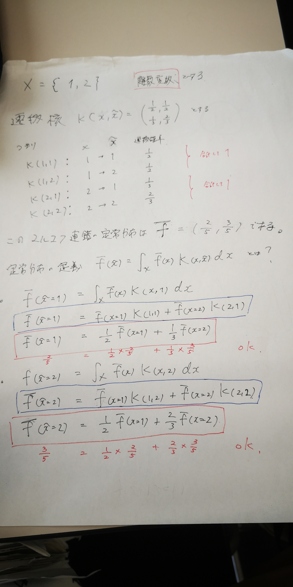
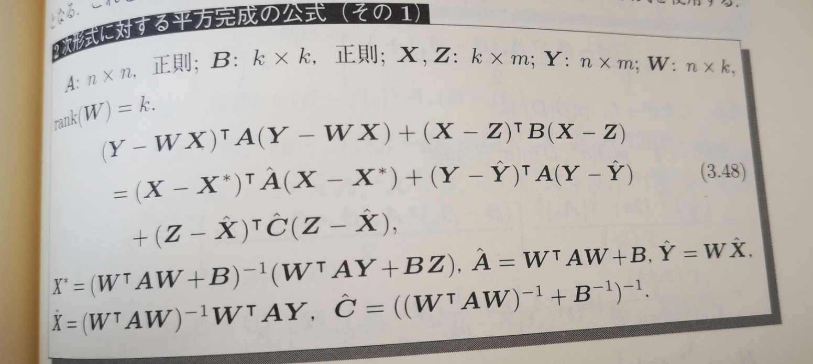
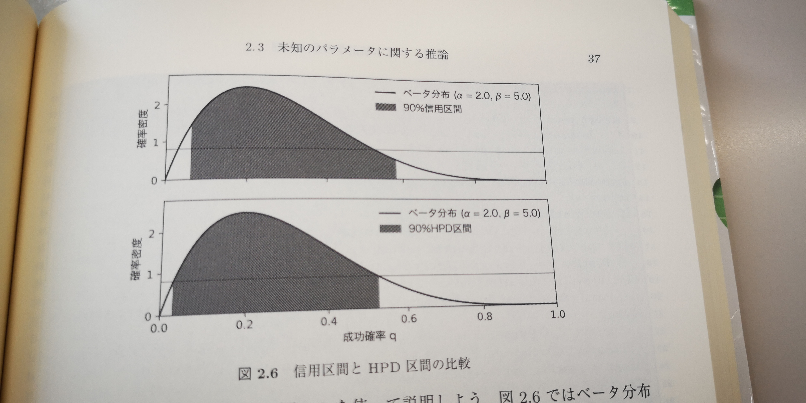

```{r setup, include=FALSE}
knitr::opts_chunk$set(echo = TRUE)
```
<br />
<br />

## **1. マルコフ連鎖モンテカルロ法(MCMC) の原理（復習含む）**
<br />
<br />

事後分布を得たいですが、積分計算が複雑で事後分布 (の基本統計量) を解析的に得ることは難しいです。
<br />

→　パラメータの事後分布から乱数を発生させて近似することを考えます。

<br />

このような乱数生成に「マルコフ連鎖」を用います。

<br />
<br />

### **マルコフ連鎖とは**
<br />

確率変数の系列 $X_0,X_1, ... , X_\infty$ を考えます。

<br />

マルコフ連鎖においては、時点 $t$ における確率変数 $X_t$ の条件付き確率分布は
$$
\begin{eqnarray}
f_t(\,x_t\,|\,x_0,x_1,...,x_{t-1}\,) = f(\,x_t\,|\,x_{t-1}\,)
\end{eqnarray}
$$
<br />
と表現され、時点 $t-1$ における 確率変数の実現値 $x_{t-1}$ のみに依存します
（マルコフ性）。
<br />

また、「斉時性」を満たすマルコフ連鎖では、$f(\,x_t\,|\,x_{t-1}\,)$ は時間を通じて一定です。
<br />

この $f(\,x_t\,|\,x_{t-1}\,)$ を遷移核と呼びます。&emsp; ( $K(\,x_{t-1},x_t\,)$ と表記します）


<br />
<br />

(例: 醤油のシェアの遷移)
<br />

状態推移行列を
$$
A =
\begin{pmatrix}
0.6 & 0.2 & 0.2\\
0.1 & 0.8 & 0.1\\
0.2 & 0.3 & 0.5
\end{pmatrix}
$$
としたとき、常に

$$
\begin{pmatrix}
x^{(1)}_t \\
x^{(2)}_t \\
x^{(3)}_t
\end{pmatrix}^T
= A \cdot
\begin{pmatrix}
x^{(1)}_{t-1} \\
x^{(2)}_{t-1} \\
x^{(3)}_{t-1}
\end{pmatrix}^T
$$
となり、

$$
\begin{eqnarray}
f_t(\,x_t\,|\,x_0,x_1,...,x_{t-1}\,) &=& f(\,x_t\,|\,x_{t-1}\,)\\
&=& K(\,x_t,x_{t-1}\,)
\end{eqnarray}
$$
が成り立つ。
<br />

(例: 終わり)

<br />
<br />

同時確率密度関数は
$$
\begin{eqnarray}
f(\,x_0,x_1,...,x_t\,) &=& f_0(\,x_0\,)  \times f_1(\,x_1\,|\,x_0\,) \times f_2(\,x_2\,|\,x_0\,,\,x_1\,)\\
&& ... \times f_t(\,x_2\,|\,x_0\,,\,x_1\,,...,)\\\\
&=&  f_0(\,x_0\,) \prod_{s=1}^{t}  K(\,x_s,x_{s-1}\,)
\end{eqnarray}
$$
<br />

依って、周辺確率分布は
$$
\begin{eqnarray}
f(\,x_t\,) &=&  f_0(\,x_0\,) \int_{X}\int_{X} \cdot\cdot\cdot \int_{X} \,\prod_{s=1}^{t}  K(\,x_s,x_{s-1}\,)\, dx_1dx_2...dx_{t-1}\\
\\
&=& f_0 \circ  K^t
\end{eqnarray}
$$
<br />

と書けます。　&emsp;（ここで、$K^2=\int_{X}K(\,x_t,x_{t-1}\,)\cdot K(\,x_{t-1},x_{t-2}\,)\,dx_{t-1}$）
<br />

（積分は $x_{t-2}$ から $x_{t}$ までの遷移確率を考えるとき、途中経路 $x_{t-1}$ を区別せず全ての経路を合計した確率という解釈でよい）

<br />

したがって、$f(\,x_t\,)$ は初期状態 $f_0$ と遷移核 $K=f(\,k_s\,|\,x_{s-1}\,)$ のみに依存します。

<br />
<br />

### **マルコフ連鎖の定常分布(不変分布; invariant distribution)**

<br />

$$
\begin{eqnarray}
\bar{f}(\,x_t\,) &=&  \int_X \bar{f}(\,x_{t-1}\,) K(\,x_t,x_{t-1}\,)\, dx_{t-1}\\
\\
\bar{f} &=& \bar{f} \circ  K
\end{eqnarray}
$$
<br />

を満たす $\bar{f}$ をマルコフ連鎖の定常分布・不変分布といいます。
<br />

(より一般的に, $\bar{f}(\tilde{x}) =  \int_X \bar{f}(\,x\,) \,K(\,x,\tilde{x}\,)\, dx$)
<br />

つまり、遷移しても各値・状態の確率が変化しない、そんな分布です。

<br />

$\bar{f}$に関して、
$$
\begin{eqnarray}
\bar{f} &=& \bar{f} \circ  K^t
\end{eqnarray}
$$
<br />

が成り立ちます。
<br />



<br />

定常分布$\bar{f}$の重要な十分条件として「詳細釣合条件 (detailed balance)」があります。
<br />

任意の$\tilde{x},x\,\in X$ に関して、
$$
\begin{eqnarray}
\bar{f}(\,x\,) K(\,\tilde{x}\,,\,x\,)&=&\bar{f}(\,\tilde{x}\,) K(\,\tilde{x}\,,\,x\,)
\end{eqnarray}
$$
<br />

つまり任意の2点（状態）の間で、流入量（確率）と流出量（確率）が一致するということです。
<br />

この条件が成り立つとき、必ず $\bar{f}(\,x\,)$ は定常分布になります。

<br />
<br />

### **MCMCにおけるマルコフ連鎖**

<br />

「欲しい事後分布」が定常分布となるようなマルコフ連鎖（遷移核）を作成します。

<br />

#### **MCMCで用いるマルコフ連鎖に満たしてほしい「性質」**

<br />


**①定常分布が一意に定まるマルコフ連鎖であってほしい**

<br />

全ての状態が再帰的である（一度その状態を出てもいつか戻ってこられる)

$\iff$

既約な（任意の状態から任意の状態へ行き来できる）マルコフ連鎖に関して、定常分布が一意に定まる
<br />

（そもそも既約でない場合も定常分布はただ一つに定まらない）


<br />

**②初期状態（値）に関係なく、定常分布に収束してほしい**

<br />

マルコフ連鎖が「エルゴード性(ergodicity)」を持つ (既約かつ周期を持たない)

$\Rightarrow$ 

定常分布が一意に存在し初期状態に関係なく $t \rightarrow \infty$ で収束 (これを均衡分布という)

<br />

さらに任意の状態から任意の状態への推移確率が正であれば、エルゴード性は満たされる
（1回の遷移でどこでも行ける可能性あり;十分条件）

<br />

（この辺の内容は主に以下の資料を参考にしました）
<br />

Bishop(2006) PRML（機械学習の黄色い本）第11章「Sampling Method」<br>
[wikipedia 「マルコフ連鎖」](https://ja.wikipedia.org/wiki/%E3%83%9E%E3%83%AB%E3%82%B3%E3%83%95%E9%80%A3%E9%8E%96)<br>
[東工大 「マルコフ解析」マルコフ過程入門](https://www.google.com/url?sa=t&rct=j&q=&esrc=s&source=web&cd=&ved=2ahUKEwjP4u-ErerwAhUBa94KHRyYAb4QFjAAegQIBBAD&url=http%3A%2F%2Fwww.ocw.titech.ac.jp%2Findex.php%3Fmodule%3DGeneral%26action%3DDownLoad%26file%3D201602394-2401-0-1.pdf%26type%3Dcal%26JWC%3D201602394&usg=AOvVaw2Irv_Guj_ICJi9pAJfVfnj)

<br />

まとめると、吸収状態や周期性などがなく、自由に行き来ができるマルコフ連鎖なら大体OKです。

<br />
<br />

#### **マルコフ連鎖からの乱数生成の手続き**

<br />

次に、実際にマルコフ連鎖からどのように乱数を生成するかについてです。

前提条件：
<br />

① $f_0$ から乱数生成可能<br>
② $K(\,x_{t-1},x_t\,)$　から乱数生成可能<br>
③ $K(\,x_{t-1},x_t\,)$　がエルゴード性を満たす
<br />
<br />

- *step1 : t = 1 にセット, $f_0(x_0)$ から乱数発生&emsp;( $x_0$ )*
<br />
- *step2 : $K(x_{t-1},x_t)$ から乱数発生&emsp;( $x_t$ )*
<br />
- *step3 : t を 1 増やし、Step2に戻る*
<br />
<br />

マルコフ連鎖が均衡分布に収束したと考えられるほど $t$ が大きくなった後の $x_t$ の系列は目標分布(事後分布)
から生成された乱数とみなすことができます。

<br />

$\rightarrow$ では、どうやって事後分布 $f(\theta)$ を均衡分布に持つマルコフ連鎖　$K(\,\theta^{(t-1)},\theta^{(t)}\,)$ を作るか。

<br />

今回はGibbs Samplerを紹介します。

<br />
<br />


## **2. ギブス・サンプラー（ギブスサンプリング;GS法)**

<br />

多変数の乱数を得るためのサンプリング法。今回は単純化のため、2変数 $(\theta_1,\theta_2)$ で考えます。
<br />
<br />

想定する状況は、2変数の同時確率分布 $f(\theta_1,\theta_2)$ があるが、この分布から同時に2変数の
乱数を得ることができない状況。
<br />

ベイズ推定の文脈で言えば、推定したいパラメータが複数あり、それらの同時事後確率密度関数の数式に積分が入っており、
解析的な評価はできず、乱数もその分布から直接得ることができないという状況です。（極めてよくありそうです。）
<br />
<br />

一方で、条件付き確率分布　$f(\theta_1|\theta_2)$ , $f(\theta_2|\theta_1)$ は分かっており（＝解析的に評価可能）、さらに、
ここからは乱数を得られる状況、乱数生成器が存在する（$\fallingdotseq$ 条件付き分布が有名な分布である）状況です。
<br />
<br />

つまり、用いられるのは、**「どちらか片方の変数の値があれば、もう片方の変数の乱数を容易に得ることができる」**ような状況です。
<br />

（3次元以上の場合、「他の全ての変数の値があれば、もう片方の変数の乱数を容易に得ることができる」状況）
<br />

ベイズ推定の文脈で言えば、同時事後確率密度関数は解析的な評価ができない分布だけど、条件付き事後確率密度関数は分かるし、有名な分布
であるという状況で使われます（詳しくは後述します）。

<br />
<br />

### **ギブス・サンプラーのアルゴリズム**
<br />
<br />

このような状況で、以下の手続きを行うことで2変数 $\boldsymbol{\theta}=(\theta_1,\theta_2)$ の乱数を得ることができます。
<br />

- *step1 : t = 1 にセット, $\theta_2$ の適当な初期値を生成 &emsp; ( $\theta_2^{(0)}$ )*
<br />

- *step2 : $\theta_2^{(t-1)}$ を使って $f(\theta_1|\theta_2^{(t-1)})$ により $\theta_1$ の乱数*
*を生成 &emsp; ($\theta_1^{(t)}$)*
<br />

- *step3 : $\theta_1^{(t)}$ を使って $f(\theta_2|\theta_1^{(t)})$ により $\theta_2$ の乱数*
*を生成 &emsp; ($\theta_2^{(t)}$)*
<br />
\theta_2,
- *step4 : t を 1 増やし、Step2に戻る*
<br />
<br />

**「他の変数の値があれば、もう片方の変数の乱数を容易に得ることができる」**ような状況なので、「手元にある$\theta_2$ を使って $\theta_1$を発生」と
「手元にある$\theta_1$ を使って $\theta_2$を発生」を交互に繰り返すイメージです。
<br />

3次元以上のの場合は、「手元にある$\theta_2,\theta_3,..\theta_k$ を使って $\theta_1$を発生」
「手元にある$\theta_1,\theta_3,..\theta_k$を使って $\theta_2$を発生」,...,「手元にある$\theta_1,\theta_2,..\theta_{k-1}$を使って $\theta_k$を発生」を繰り返します。
<br />

こうして得た多次元の変数の系列$\left[\boldsymbol{\theta^{(1)}},\boldsymbol{\theta^{(2)}},...,\boldsymbol{\theta^{(T)}}\right]$ のうち、序盤のバーンイン期間を除いた分を、乱数のサンプリングとします。
<br />
<br />


このギブス・サンプラーの遷移核は
$$
K(\,\boldsymbol{\theta}^{(t-1)},\boldsymbol{\theta}^{(t)}\,) =
f(\theta_2^{(t)}|\theta_1^{(t)}) \cdot f(\theta_1^{(t)}|\theta_2^{(t-1)})
$$
<br />

この遷移核の定常分布が求めたい $f(\theta_1^{(t)},\theta_2^{(t)}) = f(\boldsymbol{\theta}^{(t)})$ であることを確認します。
<br />

定常分布の定義は、$\bar{f}(\tilde{x}) =  \int_X \bar{f}(\,x\,) \,K(\,x,\tilde{x}\,)\, dx$ でした。

今回の場合だと、(右辺)は
$$
\begin{eqnarray}
\int_\boldsymbol{\theta} f(\boldsymbol{\theta}^{(t-1)}) \,K(\,\boldsymbol{\theta}^{(t-1)},\boldsymbol{\theta}^{(t)}\,)\, d\boldsymbol{\theta}^{(t-1)}
&=& \int_{\theta_1} \int_{\theta_2} f(\theta_1^{(t-1)},\theta_2^{(t-1)}) \,\cdot f(\theta_2^{(t)}|\theta_1^{(t)}) \cdot f(\theta_1^{(t)}|\theta_2^{(t-1)})\, d{\theta_1^{(t-1)}}d{\theta_2^{(t-1)}}\\
\\
&=& f(\theta_2^{(t)}|\theta_1^{(t)}) \int_{\theta_1} \int_{\theta_2} f(\theta_1^{(t-1)},\theta_2^{(t-1)}) \cdot f(\theta_1^{(t)}|\theta_2^{(t-1)})\, d\theta_1^{(t-1)} d\theta_2^{(t-1)}\\
\\
&=& f(\theta_2^{(t)}|\theta_1^{(t)}) \int_{\theta_2} f(\theta_1^{(t)}|\theta_2^{(t-1)}) \left[\int_{\theta_1} f(\theta_1^{(t-1)},\theta_2^{(t-1)})\, d\theta_1^{(t-1)}\right] d\theta_2^{(t-1)}\\
\\
&=& f(\theta_2^{(t)}|\theta_1^{(t)}) \int_{\theta_2} f(\theta_1^{(t)}|\theta_2^{(t-1)}) f(\theta_2^{(t-1)}) \,d\theta_2^{(t-1)}\\
\\
&=& f(\theta_2^{(t)}|\theta_1^{(t)}) \int_{\theta_2} f(\theta_1^{(t)},\theta_2^{(t-1)}) \,d\theta_2^{(t-1)}\\
\\
&=& f(\theta_2^{(t)}|\theta_1^{(t)}) f(\theta_1^{(t)})\\
\\
&=& f(\theta_2^{(t)},\theta_1^{(t)})\\
\\
&=& f(\boldsymbol{\theta}^{(t)})
\end{eqnarray}
$$
<br />

となり、$f(\boldsymbol{\theta}^{(t)})$ と一致。したがって求めたい目標分布（事後分布）が定常分布となっています。
<br />

さらに、条件付き分布の性質より、$f(\theta_1,\theta_2) > 0$ を満たす任意の $(\theta_1,\theta_2)$ に関して、遷移核 $f(\theta_2^{(t)}|\theta_1^{(t)}) \cdot f(\theta_1^{(t)}|\theta_2^{(t-1)})$ は正の値をとるので、エルゴード性も満たされます。
<br />

依って、十分な回数遷移（乱数発生）を繰り返せば、初期値に拘わらず、一意な定常分布（均衡分布）に収束します。
<br />

均衡分布に収束後に発生したあとの乱数を集めれば、事後分布からのサンプリングとみなすことができるわけです。
<br />
<br />

基本的に、このGS法はMH法に比べ、主に以下のメリットがあります。
<br />

- 発生される乱数は全て「acccept」されるアルゴリズムなので無駄がなく、時短になる。
<br />

- 「提案分布のパラメータ」（ランダムウォークのノイズの分散など）を設定する必要がないので簡単。
<br />
<br />

逆にデメリットとしては、
<br />

- 条件付き事後確率密度関数が（正規化定数の積分計算なしに）評価でき、有名な分布になる場合にしか使えない。
<br />

- 条件付き事後確率密度関数を自分で導出するとなるとかなり煩雑。
<br />

1点目のデメリットは、GS法の step2 での一部MH法のアルゴリズムを取り入れることで対応できます（後述のギブス内メトロポリス法）。
<br />

2点目のデメリットは、各々のモデルについて、有名な事前分布を使う（既に条件付き事後分布が知られているもの）ことで対処できるかもです。
<br />
<br />

では、実際のモデルを考えたとき、どういう事前分布を用いれば、このアルゴリズムを使うことができるのでしょうか？

<br />
<br />


### **GS法における事前分布の設定**
<br />
<br />

「GS法が適用できる事前分布」とはどんな事前分布なんでしょうか？
<br />

ここで自然共役事前分布（$\fallingdotseq$ 同時事後分布が評価できる事前分布）を思い出してください。
<br />

自然共役事前分布は、「カーネル×知っている定数( $C$ )」が同時事後分布になる（積分して1になる）ような事前分布と解釈できることを
説明しました（正規化定数の積分計算がいらない）。
<br />

カーネルは「尤度×同時事前分布」ですから自然共役事前分布の場合、以下のような表現ができます。
(以下、単純化のため、$\alpha$ を省略して $\beta,\sigma^2$のみのモデルとします。)
<br />

$$
\begin{eqnarray}
Kernel &=& \underbrace{f((x_1,y_1),(x_2,y_2),\,...\, ,(x_N,y_N)\,|\,\beta,\sigma)}_{尤度}\,\cdot\,\underbrace{f(\beta,\sigma^2)}_{同時事前分布}\\
\\
&=& \underbrace{f((x_1,y_1),(x_2,y_2),\,...\, ,(x_N,y_N)\,|\,\beta,\sigma)}_{尤度}\,\cdot\,\underbrace{f(\beta\,|\,\sigma^2)\cdot f(\sigma^2)\ }_{同時事前分布}\\
\\
C \cdot Kernel &=& C \cdot f((x_1,y_1),(x_2,y_2),\,...\, ,(x_N,y_N)\,|\,\beta,\sigma)\,\cdot\,f(\beta\,|\,\sigma^2)\cdot f(\sigma^2)\\
\\
&\,&\int_{-\infty}^{\infty} (C \cdot Kernel) \,d\beta\,d\sigma = 1
\end{eqnarray}
$$
<br />
<br />

一方で、GS法はMCMCの一種ですので、「GS法で適用できる事前分布」は $C \cdot Kernel$ が積分して1になるというこんな厳しい条件を満たす必要がありません。
<br />

「GS法で使える事前分布」は（$\fallingdotseq$ 条件付き事後分布が評価できる事前分布（正規化定数の積分計算無しで））ですので、
<br />

「『他のパラメータで条件付けた時のカーネル』 ×　知っている定数( $C_1\,or\,C_2$ )」が積分して１になれば　(= 条件付き事後分布になれば)　OKです。
<br />

$$
\begin{eqnarray}
Kernel &=& \underbrace{f((x_1,y_1),(x_2,y_2),\,...\, ,(x_N,y_N)\,|\,\beta,\sigma)}_{尤度}\,\cdot\,\underbrace{f(\beta,\sigma^2)}_{同時事前分布}\\
\\
&=& \underbrace{f((x_1,y_1),(x_2,y_2),\,...\, ,(x_N,y_N)\,|\,\beta,\sigma)}_{尤度}\,\cdot\,\underbrace{f(\beta\,|\,\sigma^2)\cdot f(\sigma^2)\ }_{同時事前分布}\\
\\
&=& \underbrace{f((x_1,y_1),(x_2,y_2),\,...\, ,(x_N,y_N)\,|\,\beta,\sigma)}_{尤度}\,\cdot\,\underbrace{f(\sigma^2\,|\,\beta)\cdot f(\beta)\ }_{同時事前分布}\\
\\
\\
Kernel\,|\,\sigma^2 &=& \frac{f((x_1,y_1),(x_2,y_2),\,...\, ,(x_N,y_N)\,|\,\beta,\sigma)\,\cdot\,f(\beta\,|\,\sigma^2)\cdot f(\sigma^2)}{f(\sigma^2)} \\
\\
&=& f((x_1,y_1),(x_2,y_2),\,...\, ,(x_N,y_N)\,|\,\beta,\sigma)\,\cdot\,f(\beta\,|\,\sigma^2)\\
\\
\\
Kernel\,|\,\beta &=& \frac{f((x_1,y_1),(x_2,y_2),\,...\, ,(x_N,y_N)\,|\,\beta,\sigma)\,\cdot\,f(\sigma^2\,|\,\beta)\cdot f(\sigma^2)}{f(\beta)} \\
\\
&=& f((x_1,y_1),(x_2,y_2),\,...\, ,(x_N,y_N)\,|\,\beta,\sigma)\,\cdot\,f(\sigma^2\,|\,\beta)\\
\\
\\
\int_{-\infty}^{\infty} \,(&C_1& \cdot Kernel\,|\,\sigma^2)\, \,d\beta\,d\sigma = 1\,,\,\,
\int_{-\infty}^{\infty} \,(C_2 \cdot Kernel\,|\,\sigma^2) \,\,d\beta\,d\sigma = 1
\end{eqnarray}
$$
<br />

まとめると、『他のパラメータで条件付けた時のカーネル』に定数を掛けたとき、ちゃんと条件付き分布になってくれる事前分布を用います。

<br />
『他のパラメータで条件付けた時のカーネル』の方が、普通のカーネルより掛け算する式が少ない分、うまいこと定数を掛ければ、確率の公理を
満たすのが簡単そうです。また、条件付けたパラメータを定数として扱えるのも便利です。

<br />


<br />
<br />

### **線形回帰モデルでGS法を使う**

<br />
<br />


回帰モデル
<br />

$$
Y_i = \alpha^{true} + \beta^{true} X_i + u_i \quad,\quad u_i \sim Normal\,(0,{\sigma^{true}}^2)
$$
<br />

を考えます。
<br />

同時事前分布は、多変量正規分布と逆ガンマ分布を用います。
<br />

$$ 
\begin{eqnarray}
\alpha,\beta\,|\,\sigma^2 &\sim& \boldsymbol{MultiNorm_2} \left(
\begin{pmatrix}
\alpha_0 \\\beta_0 \\\end{pmatrix}_,\, 
\begin{pmatrix}
s_{\alpha}^2 & 0 \\0 & s_{\beta}^2 \\
\end{pmatrix}
\right)\\\\
\sigma^2&\sim& InverseGamma \left( \,\frac{\nu_0}{2},\frac{\lambda_0}{2} \right)
\end{eqnarray}
$$
<br />

自然共役事前分布との違いは、$\alpha, \beta$ の分散パラメータが、$\sigma^2$ には依存していない点です。それ以外は
全て一緒です。
<br />

したがって、こちらの方が仮定が緩く、より柔軟な事前分布であるとされているようです。
<br />

回帰モデルにおけるギブス・サンプラーでは、「ブロックごとの」ギブス・サンプラーを用います。
<br />

普通のGS法では、多次元の乱数について1次元ごと乱数を発生させていきました。
<br />
<br />

- *step2 : $\theta_2^{(t-1)}$ を使って $f(\theta_1|\theta_2^{(t-1)})$ により $\theta_1$ の乱数*
*を生成 &emsp; ($\theta_1^{(t)}$)*
<br />

- *step3 : $\theta_1^{(t)}$ を使って $f(\theta_2|\theta_1^{(t)})$ により $\theta_2$ の乱数*
*を生成 &emsp; ($\theta_2^{(t)}$)*
<br />
<br />

しかし得たい乱数($\boldsymbol{\theta}$)の次元が大きくなると、収束が遅くなることが経験的に知られています。
<br />

このような場合、乱数($\boldsymbol{\theta}$)の次元をいくつかのブロック(($\boldsymbol{\theta_a,\theta_b,...}$))に分け、すべてのブロックで
完全条件付き確率分布(= 条件付き多変数確率分布, $f(\boldsymbol{\theta_i}\,|\boldsymbol{\theta_{-i}})$) から容易に乱数が手に入るならば、
「ブロックごとの」ギブス・サンプラーを使うことができます。
<br />

これは、1次元ごとでなく、各ブロック（1ブロックに複数次元が所属）ごと乱数を発生させるアルゴリズムです。
<br />

今回の回帰モデルの場合、$\alpha,\beta$ が共に正規分布（多変量正規分布）を事前分布に持つので、この2次元について乱数生成可能な
条件付き多変数確率分布が存在しそうです。
<br />

したがって、$\alpha,\beta$ を1つの「ブロック」とし、同時に乱数を生成させる以下のGS法を用います。
<br />
<br />

- *step1 : t = 1 にセット, $\sigma^2$ の適当な初期値を生成 &emsp; ( ${\sigma^2}^{(0)}$ )*
<br />

- *step2 : $\sigma_2^{(t-1)}$ を使って $f(\alpha,\beta|{\sigma^2}^{(t-1)})$ により $\alpha,\beta$ の乱数*
*を生成 &emsp; ($\alpha^{(t)},\beta^{(t)}$)*
<br />

- *step3 : $\alpha^{(t)},\beta^{(t)}$ を使って $f(\sigma^2|\alpha^{(t)},\beta^{(t)})$ により $\theta_2$ の乱数*
*を生成 &emsp; (${\sigma^2}^{(t)}$)*
<br />

- *step4 : t を 1 増やし、Step2に戻る*
<br />
<br />

では、条件付き事後確率密度関数$f(\alpha,\beta|{\sigma^2}),f(\sigma^2|\alpha,\beta)$ を導出していきましょう。
<br />
<br />

要素表記だと式展開が煩雑すぎるので、以下の行列・ベクトルを導入します(サンプルサイズ$N$ で、変数の数を$K$を増やします)。
<br />
<br />

**モデル**
<br />

$$
\begin{eqnarray}
\boldsymbol{y} = 
\begin{pmatrix}
y_1\\ y_2\\ \vdots\\ y_N\\
\end{pmatrix}_, \quad
\boldsymbol{X} = 
\begin{pmatrix}
1 & x_{1,1} & x_{1,2} & \ldots & x_{1,K}\\
1 & x_{2,1} & x_{2,2} & \ldots & x_{2,K}\\
\vdots & \vdots & \vdots & \ddots & \vdots\\
1 & x_{N,1} & x_{N,2} & \ldots & x_{N,K}\\
\end{pmatrix}_, \quad
\boldsymbol{\beta} = 
\begin{pmatrix}
\alpha \\
\beta_1 \\
\vdots \\
\beta_K
\end{pmatrix}_,\ \ \
\boldsymbol{u} = \begin{pmatrix}
u_1 \\
u_2 \\
\vdots \\
u_N \\
\end{pmatrix}_,\ \ \
\boldsymbol{0} = 
\begin{pmatrix}
0 \\
0 \\
\vdots \\
0 \\
\end{pmatrix}_,\ \ \
\sigma^2\boldsymbol{I} = 
\begin{pmatrix}
\sigma^2 & 0 & \ldots & 0\\
0 & \sigma^2 & \ldots & 0\\
\vdots & \vdots & \ddots & \vdots\\
0 & 0 & \ldots & \sigma^2\\
\end{pmatrix}
\end{eqnarray}
$$
$$
\begin{eqnarray}
\underbrace{\boldsymbol{y}}_{(N × 1)} = \overbrace{\underbrace{\boldsymbol{X}}_{(N × K)} 
\cdot \underbrace{\boldsymbol{\beta}}_{(K × 1)}}^{(N × 1)} + \underbrace{\boldsymbol{u}}_{(N × 1)} \quad,\quad \boldsymbol{u} \sim \boldsymbol{MultiNorm}_{N}\,(\underbrace{\boldsymbol{0}}_{(N × 1)},\underbrace{\sigma^2\boldsymbol{I}}_{(N × N)})
\end{eqnarray}
$$
<br />

整理すると
<br />

$$
\begin{eqnarray}
\begin{pmatrix}
y_1\\
y_2\\
\vdots\\
y_N\\
\end{pmatrix}
=\begin{pmatrix}
\,\alpha\, + \,\beta_1 x_{1,1}\, + \,\beta_2 x_{1,2}\, + \,\ldots\, + \,\beta_K x_{1,K}\, +\,u_1\\
\,\alpha\, + \,\beta_1 x_{2,1}\, + \,\beta_2 x_{2,2}\, + \,\ldots\, + \,\beta_K x_{2,K}\, +\,u_1\\
\vdots\\
\,\alpha\, + \,\beta_1 x_{N,1}\, + \,\beta_2 x_{N,2}\, + \,\ldots\, + \,\beta_K x_{N,K}\, +\,u_N\\
\end{pmatrix}_,\\
\\
\begin{pmatrix}
u_1\\
u_2\\
\vdots\\
u_N\\
\end{pmatrix}
\sim \boldsymbol{MultiNorm}_{N}\,\left(
\begin{pmatrix}
0\\
0\\
\vdots\\
0\\
\end{pmatrix}_,
\begin{pmatrix}
\sigma^2 & 0 & \ldots & 0\\
0 & \sigma^2 & \ldots & 0\\
\vdots & \vdots & \ddots & \vdots\\
0 & 0 & \ldots & \sigma^2\\
\end{pmatrix}
\right)
\end{eqnarray}
$$
<br />
<br />

**事前分布**
<br />

$$
\begin{eqnarray}
\boldsymbol{\beta_0} = \begin{pmatrix}
\alpha_0 \\
\beta_{01} \\
\vdots \\
\beta_{0K}
\end{pmatrix}_,\ \ \
\boldsymbol{A_0}^{-1} = \begin{pmatrix}
a_{00} & a_{01} & \ldots & a_{0k}\\
a_{10} & a_{11} & \ldots & a_{1k}\\
\vdots & \vdots & \ddots & \vdots\\
a_{K0} & a_{K1} & \ldots & a_{K2} \\
\end{pmatrix}
\end{eqnarray}
$$
$$
\begin{eqnarray}
\boldsymbol{\beta} &\sim& \boldsymbol{MultiNorm}_{K+1}\,\left(\boldsymbol{\beta_0},\boldsymbol{A_0}^{-1}\right)\\
\\
\sigma^2 &\sim& InverseGamma \left( \,\frac{\nu_0}{2},\frac{\lambda_0}{2} \right)
\end{eqnarray}
$$
<br />

$\boldsymbol{\beta}$ の事前分布の分散共分散行列が $\boldsymbol{A_0}^{-1}$ と逆行列の形になっていることに注意してください。逆行列を取らない $\boldsymbol{A_0}$ は「精度行列」と呼ばれます。これは後々出てくる条件付き事後分布の表現を簡単にするための工夫です。また、対角成分以外（共分散）は通常0になると思います。

<br />

同時事前分布は
<br />

$$
\begin{eqnarray}
f(\boldsymbol{\beta},\sigma^2) &=& f(\boldsymbol{\beta})\,\cdot f(\sigma^2)\\
\\
f(\boldsymbol{\beta}) &=& (2\pi)^{-\frac{K+1}{2}}|\boldsymbol{A_0}|^{\frac{1}{2}}\exp\left[-\frac{1}{2}(\boldsymbol{\beta} - \boldsymbol{\beta_0})^T\boldsymbol{A_0}\,(\boldsymbol{\beta} - \boldsymbol{\beta_0})\right]\\
\\
f(\sigma^2) &=& \frac{\left(\frac{\lambda_0}{2}\right)^\frac{\nu_0}{2}}{\Gamma(\frac{\nu_0}{2})}(\sigma^2)^{-\left(\frac{\nu_0}{2}+1\right)}\,\cdot\,
\exp\left(-\frac{\lambda_0}{2\sigma^2}\right)
\end{eqnarray}
$$

<br />

**尤度**
$$
f(\,\boldsymbol{y}\,|\,\boldsymbol{X},\boldsymbol{\beta},\sigma^2\,) = (2\pi\sigma^2)^{-\frac{N}{2}} \exp\left[-\frac{1}{2\sigma^2} (\boldsymbol{y} - \boldsymbol{X}\boldsymbol{\beta})^T(\boldsymbol{y} - \boldsymbol{X}\boldsymbol{\beta})\right]
$$
<br />
<br />

カーネルは
$$
\begin{eqnarray}
Kernel &=& \underbrace{f(\,\boldsymbol{y}\,|\,\boldsymbol{X},\boldsymbol{\beta},\sigma^2\,)}_{尤度}\,\cdot\,\underbrace{f(\beta,\sigma^2)}_{同時事前分布}\\
\\
&=& (2\pi\sigma^2)^{-\frac{N}{2}} \exp\left[-\frac{1}{2\sigma^2} (\boldsymbol{y} - \boldsymbol{X}\boldsymbol{\beta})^T(\boldsymbol{y} - \boldsymbol{X}\boldsymbol{\beta})\right] \cdot  (2\pi)^{-\frac{K+1}{2}}|\boldsymbol{A_0}|^{\frac{1}{2}}\exp\left[-\frac{1}{2}(\boldsymbol{\beta} - \boldsymbol{\beta_0})^T\boldsymbol{A_0}\,(\boldsymbol{\beta} - \boldsymbol{\beta_0})\right]\\
&\cdot& \frac{\left(\frac{\lambda_0}{2}\right)^\frac{\nu_0}{2}}{\Gamma(\frac{\nu_0}{2})}(\sigma^2)^{-\left(\frac{\nu_0}{2}+1\right)}\,\cdot\,
\exp\left(-\frac{\lambda_0}{2\sigma^2}\right)\\
\\
&=& \underbrace{(2\pi)^{-\frac{N+K+1}{2}} |\boldsymbol{A_0}|^{\frac{1}{2}} \cdot \frac{\left(\frac{\lambda_0}{2}\right)^\frac{\nu_0}{2}}{\Gamma(\frac{\nu_0}{2})}}_{定数}\cdot(\sigma^2)^{-\left(\frac{N+\nu_0}{2}+1\right)}
\exp\left[-\frac{1}{2\sigma^2} \{(\boldsymbol{y} - \boldsymbol{X}\boldsymbol{\beta})^T(\boldsymbol{y} - \boldsymbol{X}\boldsymbol{\beta})+\lambda_0\}
-\frac{1}{2}(\boldsymbol{\beta} - \boldsymbol{\beta_0})^T\boldsymbol{A_0}\,(\boldsymbol{\beta} - \boldsymbol{\beta_0})\right]

\end{eqnarray}
$$
<br />

定数は割り算して消せばいいですが、$\exp$ の中身が $-\frac{1}{2\sigma^2}$ でくくれ切れていないので、正規分布の確率密度関数の形に持っていくのは厳しそうです。

→　全体としても定数をかけて確率密度関数の形には出来なそうです。
<br />

依って、解析解は諦め、GS法に依る乱数生成を行います。
<br />
<br />

まず、「他のパラメータで条件付けた時のカーネル」を計算します。
<br />

まずは「 $\sigma^2$ で条件付けた時のカーネル」
<br />

$$
\begin{eqnarray}
Kernel\,|\,\sigma^2 &=& f(\,\boldsymbol{y}\,|\,\boldsymbol{X},\boldsymbol{\beta},\sigma^2\,) \,\cdot f(\,\boldsymbol{\beta}\,|\,\sigma^2\,)\\
\\
&=& f(\,\boldsymbol{y}\,|\,\boldsymbol{X},\boldsymbol{\beta},\sigma^2\,) \,\cdot f(\,\boldsymbol{\beta}\,)\\
\\
&=& (2\pi\sigma^2)^{-\frac{N}{2}} \exp\left[-\frac{1}{2\sigma^2} (\boldsymbol{y} - \boldsymbol{X}\boldsymbol{\beta})^T(\boldsymbol{y} - \boldsymbol{X}\boldsymbol{\beta})\right] \cdot (2\pi)^{-\frac{N}{2}}|\boldsymbol{A_0}|^{\frac{1}{2}}\exp\left[-\frac{1}{2}(\boldsymbol{\beta} - \boldsymbol{\beta_0})^T\boldsymbol{A_0}\,(\boldsymbol{\beta} - \boldsymbol{\beta_0})\right]\\
\\
&=& \underbrace{(2\pi)^{-N}(\sigma^2)^{-\frac{N}{2}}|\boldsymbol{A_0}|^{\frac{1}{2}}}_{定数k_3} \cdot \exp\left[-\frac{1}{2\sigma^2}\left\{(\boldsymbol{y} - \boldsymbol{X}\boldsymbol{\beta})^T(\boldsymbol{y} - \boldsymbol{X}\boldsymbol{\beta})+\sigma^2(\boldsymbol{\beta} - \boldsymbol{\beta_0})^T\boldsymbol{A_0}\,(\boldsymbol{\beta} - \boldsymbol{\beta_0})\right\}\right]\\
\\
\frac{3}{k_1}(\,Kernel\,|\,\sigma^2\,) &=& \exp\left[-\frac{1}{2\sigma^2}\left\{(\boldsymbol{y} - \boldsymbol{X}\boldsymbol{\beta})^T(\boldsymbol{y} - \boldsymbol{X}\boldsymbol{\beta})+\sigma^2(\boldsymbol{\beta} - \boldsymbol{\beta_0})^T\boldsymbol{A_0}\,(\boldsymbol{\beta} - \boldsymbol{\beta_0})\right\}\right]\\
\\
\end{eqnarray}
$$
<br />

ここで右辺の｛｝内に関して、以下の行列の2次形式の平方完成の公式を用います。
<br />



<br />
<br />

$$
\begin{eqnarray}
&\,&(\boldsymbol{y} - \boldsymbol{X}\boldsymbol{\beta})^T(\boldsymbol{y} - \boldsymbol{X}\boldsymbol{\beta})+\sigma^2(\boldsymbol{\beta} - \boldsymbol{\beta_0})^T\boldsymbol{A_0}\,(\boldsymbol{\beta} - \boldsymbol{\beta_0})\\
\\
&=& \sigma^2(\boldsymbol{\beta} - \boldsymbol{\beta_*})^T\boldsymbol{\Sigma_*}^{-1}(\boldsymbol{\beta} - \boldsymbol{\beta_*}) + (\boldsymbol{y} - \boldsymbol{\hat{y}})^T(\boldsymbol{y} - \boldsymbol{\hat{y}}) + (\boldsymbol{\beta_0} - \boldsymbol{\hat\beta})^T ((\boldsymbol{X}^T\boldsymbol{X})^{-1}+\sigma^{-2}\boldsymbol{A_0}^{-1})^{-1} (\boldsymbol{\beta_0} - \boldsymbol{\hat\beta})\\
\\
\end{eqnarray}
$$
ただし、
$$
\boldsymbol{\beta_*} = (\sigma^{-2}\boldsymbol{X}^T\boldsymbol{X}+\boldsymbol{A_0})^{-1}(\sigma^{-2}\boldsymbol{X}^T\boldsymbol{y}+\boldsymbol{A_0\beta_0}), \quad
\boldsymbol{\Sigma_*}=(\sigma^{-2}\boldsymbol{X}^T\boldsymbol{X}+\boldsymbol{A_0})^{-1},\quad
\boldsymbol{\hat\beta}=(\boldsymbol{X}^T\boldsymbol{X})^{-1}\boldsymbol{X}^T\boldsymbol{y}, \quad
\boldsymbol{\hat{y}}=\boldsymbol{X}\boldsymbol{\hat\beta}
$$
以上より、
$$
\begin{eqnarray}
\frac{1}{k_1}(\,Kernel\,|\,\sigma^2\,) &=& \exp\left[-\frac{1}{2\sigma^2}\left\{(\boldsymbol{y} - \boldsymbol{X}\boldsymbol{\beta})^T(\boldsymbol{y} - \boldsymbol{X}\boldsymbol{\beta})+\sigma^2(\boldsymbol{\beta} - \boldsymbol{\beta_0})^T\boldsymbol{A_0}\,(\boldsymbol{\beta} - \boldsymbol{\beta_0})\right\}\right]\\
\\
&=& \exp\left[-\frac{1}{2\sigma^2}\left\{\sigma^2(\boldsymbol{\beta} - \boldsymbol{\beta_*})^T\boldsymbol{\Sigma_*}^{-1}(\boldsymbol{\beta} - \boldsymbol{\beta_*}) + (\boldsymbol{y} - \boldsymbol{\hat{y}})^T(\boldsymbol{y} - \boldsymbol{\hat{y}}) + (\boldsymbol{\beta_0} - \boldsymbol{\hat\beta})^T ((\boldsymbol{X}^T\boldsymbol{X})^{-1}+\sigma^{-2}\boldsymbol{A_0}^{-1})^{-1} (\boldsymbol{\beta_0} - \boldsymbol{\hat\beta})\right\}\right]\\
\\
&=& \exp\left[-\frac{1}{2}(\boldsymbol{\beta} - \boldsymbol{\beta_*})^T\boldsymbol{\Sigma_*}^{-1}(\boldsymbol{\beta} - \boldsymbol{\beta_*})\right]
\underbrace{\exp\left[-\frac{1}{2\sigma^2}\left\{(\boldsymbol{y} - \boldsymbol{\hat{y}})^T(\boldsymbol{y} - \boldsymbol{\hat{y}}) + (\boldsymbol{\beta_0} - \boldsymbol{\hat\beta})^T ((\boldsymbol{X}^T\boldsymbol{X})^{-1}+\sigma^{-2}\boldsymbol{A_0}^{-1})^{-1} (\boldsymbol{\beta_0} - \boldsymbol{\hat\beta})\right\}\right]}_{定数k_2}\\
\\
\frac{1}{k_1k_2}(\,Kernel\,|\,\sigma^2\,) &=& \exp\left[-\frac{1}{2}(\boldsymbol{\beta} - \boldsymbol{\beta_*})^T\boldsymbol{\Sigma_*}^{-1}(\boldsymbol{\beta} - \boldsymbol{\beta_*})\right]\\
\\
\underbrace{(2\pi)^{-\frac{K+1}{2}}|\boldsymbol{\Sigma_*}^{-1}|^{\frac{1}{2}}}_{定数}\cdot\frac{1}{k_1k_2}(\,Kernel\,|\,\sigma^2\,)
&=&\underbrace{(2\pi)^{-\frac{K+1}{2}}|\boldsymbol{\Sigma_*}^{-1}|^{\frac{1}{2}}\exp\left[-\frac{1}{2}(\boldsymbol{\beta} - \boldsymbol{\beta_*})^T\boldsymbol{\Sigma_*}^{-1}(\boldsymbol{\beta} - \boldsymbol{\beta_*})\right]}_{\boldsymbol{MultiNorm}_{K+1}(\boldsymbol{\beta_*},\Sigma_*)の多変量確率密度関数}
\end{eqnarray}
$$
<br />

「$\sigma^2$ を条件付けた時のカーネル」に「知っている定数」を掛けることで、$\boldsymbol{\beta}$についての確率密度関数の（積分して1になる）形になりました！
<br />

→ $\boldsymbol{\beta}$ の 条件付き事後分布が導出できたといえます。
<br />
<br />

次に「 $\boldsymbol{\beta}$ で条件付けた時のカーネル」
<br />
$$
\begin{eqnarray}
Kernel\,|\,\boldsymbol{\beta} &=& f(\,\boldsymbol{y}\,|\,\boldsymbol{X},\boldsymbol{\beta},\sigma^2\,) \,\cdot f(\,\sigma^2\,|\,\boldsymbol{\beta}\,)\\
\\
&=& f(\,\boldsymbol{y}\,|\,\boldsymbol{X},\boldsymbol{\beta},\sigma^2\,) \,\cdot f(\,\sigma^2\,)\\
\\
&=& (2\pi\sigma^2)^{-\frac{N}{2}} \exp\left[-\frac{1}{2\sigma^2} (\boldsymbol{y} - \boldsymbol{X}\boldsymbol{\beta})^T(\boldsymbol{y} - \boldsymbol{X}\boldsymbol{\beta})\right] \cdot \frac{\left(\frac{\lambda_0}{2}\right)^\frac{v_0}{2}}{\Gamma(\frac{v_0}{2})}(\sigma^2)^{-\left(\frac{v_0}{2}+1\right)}\cdot
\exp\left(-\frac{\lambda_0}{2\sigma^2}\right)\\
\\
&=& \underbrace{(2\pi)^{-\frac{N}{2}} \cdot \frac{\left(\frac{\lambda_0}{2}\right)^\frac{\nu_0}{2}}{\Gamma(\frac{\nu_0}{2})}}_{定数k_2} \cdot
(\sigma^2)^{-\left(\frac{N+\nu_0}{2}+1\right)} \exp\left[-\frac{(\boldsymbol{y} - \boldsymbol{X}\boldsymbol{\beta})^T(\boldsymbol{y} - \boldsymbol{X}\boldsymbol{\beta})+\lambda_0}{2\sigma^2}\right]\\
\\
\frac{1}{k_2}(\,Kernel\,|\,\boldsymbol{\beta}\,) &=& (\sigma^2)^{-\left(\frac{N+\nu_0}{2}+1\right)} \exp\left[-\frac{(\boldsymbol{y} - \boldsymbol{X}\boldsymbol{\beta})^T(\boldsymbol{y} - \boldsymbol{X}\boldsymbol{\beta})+\lambda_0}{2\sigma^2}\right]\\
\\
\end{eqnarray}
$$
ここで
$$
\begin{eqnarray}
\nu_*=n+\nu_0, \quad \lambda_* &=& (\boldsymbol{y} - \boldsymbol{X}\boldsymbol{\beta})^T(\boldsymbol{y} - \boldsymbol{X}\boldsymbol{\beta})+\lambda_0\\
\\
&=& (\boldsymbol{\beta} - \boldsymbol{\hat\beta})^T\boldsymbol{X}^T\boldsymbol{X}(\boldsymbol{\beta} - \boldsymbol{\hat\beta}) +
(\boldsymbol{y} - \boldsymbol{X}\boldsymbol{\hat\beta})^T(\boldsymbol{y} - \boldsymbol{X}\boldsymbol{\hat\beta})+\lambda_0
\end{eqnarray}
$$
とおくと、
$$
\begin{eqnarray}
\frac{1}{k_2}(\,Kernel\,|\,\boldsymbol{\beta}\,) &=& (\sigma^2)^{-\left(\frac{\nu_*}{2}+1\right)} \exp\left[-\frac{ \lambda_*}{2\sigma^2}\right]\\
\\
\underbrace{\frac{\left(\frac{\lambda_*}{2}\right)^\frac{\nu_*}{2}}{\Gamma(\frac{\nu_*}{2})}}_{定数}\cdot\frac{1}{k_2}(\,Kernel\,|\,\boldsymbol{\beta}\,) &=& \underbrace{\frac{\left(\frac{\lambda_*}{2}\right)^\frac{\nu_*}{2}}{\Gamma(\frac{\nu_*}{2})}\cdot (\sigma^2)^{-\left(\frac{\nu_*}{2}+1\right)} \exp\left[-\frac{ \lambda_*}{2\sigma^2}\right]}_{InverseGamma(\frac{\nu_*}{2},\frac{\lambda_*}{2})の確率密度関数}\\
\end{eqnarray}
$$
<br />

「$\boldsymbol{\beta}$ を条件付けた時のカーネル」に「知っている定数」を掛けることで、$\sigma^2$ についての
確率密度関数の（積分して1になる）形になりました！
<br />

→ $\sigma^2$ の 条件付き事後分布が導出できたといえます。
<br />
<br />

以上をまとめて、 $\boldsymbol{\beta}$ 及び $\sigma^2$ の条件付き事後分布は
<br />

$$
\begin{eqnarray}
\boldsymbol{\beta}\,|\,\sigma^2,\boldsymbol{X},\boldsymbol{y} &\sim& \boldsymbol{MultiNorm}_{K+1}\,\left(\boldsymbol{\beta_*},\boldsymbol{\Sigma_*}\right)\\
\\
\sigma^2\,|\,\boldsymbol{\beta}, \boldsymbol{X},\boldsymbol{y} &\sim& InverseGamma \left( \,\frac{\nu_*}{2},\frac{\lambda_*}{2} \right)\\
\\
\end{eqnarray}
$$
$$
\boldsymbol{\beta_*} = (\sigma^{-2}\boldsymbol{X}^T\boldsymbol{X}+\boldsymbol{A_0})^{-1}(\sigma^{-2}\boldsymbol{X}^T\boldsymbol{y}+\boldsymbol{A_0\beta_0}), \quad
\boldsymbol{\Sigma_*}=(\sigma^{-2}\boldsymbol{X}^T\boldsymbol{X}+\boldsymbol{A_0})^{-1},\\
\\
\nu_*=n+\nu_0, \quad \lambda_* = (\boldsymbol{\beta} - \boldsymbol{\hat\beta})^T\boldsymbol{X}^T\boldsymbol{X}(\boldsymbol{\beta} - \boldsymbol{\hat\beta}) + (\boldsymbol{y} - \boldsymbol{X}\boldsymbol{\hat\beta})^T(\boldsymbol{y} - \boldsymbol{X}\boldsymbol{\hat\beta})+\lambda_0
$$

<br />
<br />

### **線形回帰モデル　ー実装・シミュレーションー**

<br />
<br />

**線形回帰モデル・ブロックギブスサンプラーのアルゴリズム**
```{r GS_LinReg}
library(MASS)
library(invgamma)
library(ggplot2)
library(GGally)
gs_linreg <- function(y,X,iterations,b0,A0,nu0,lam0){
  
  ## y は被説明変数のベクトル
  ## X は説明変数の行列（行:サンプル、列:変数）
  ## iterations は乱数発生の個数・回数
  ## b0,A0 はそれぞれ beta の事前分布の平均と精度行列(分散共分散行列の逆行列)
  ## nu0,lam0 はそれぞれ sigma^2 の事前分布の shape parameter と scale parameter
  
  n <-  nrow(X)　　　　　　　 ## サンプルサイズnは行列Xの行数
  k <-  ncol(X) - 1　　　　　 ## 変数(係数)の数kは行列Xの列数-1
  XX <-  t(X) %*% X           ## X^T*X
  Xy <-  t(X) %*% y           ## X^T*y
  b_hat <- solve(XX) %*% Xy   ## (X^T*X)^-1*X^T*y, solve()は逆行列を計算する関数
  A0b0 <- A0 %*% b0           ## A0b0
  nu_star <- n + nu0          ## n + nu0 
  
  
  runs <- matrix(0,nrow=iterations,ncol=(k+2)) ## 発生した乱数を格納する行列
  
  sigma2 <- (t(y - (X %*% b_hat))) %*% (y - (X %*% b_hat)) / (n - k - 1)
  sigma2 <- as.numeric(sigma2)
  ## sigma^2の初期値発生（step1）
  ## 何でもよいけど、収束の早さを見込んで、OLSの残差からsigma^2を推定
  
  for (idx in 1:iterations){
    
    Large_sigma_star <- solve(XX/sigma2 + A0)   ## betaの条件付き事後確率分布の分散
    b_star <- (solve(XX/sigma2 + A0)) %*% (Xy/sigma2 + A0b0) 　　## betaの条件付き事後確率分布の平均
    b <- mvrnorm(mu=b_star,Sigma=Large_sigma_star)        ## beta の乱数発生（step2） from Multi-variate Normal
    
    lam_star <- t(b - b_hat) %*% XX %*% (b - b_hat) + t(y - X %*% b_hat) %*% (y - X %*% b_hat) + lam0 
    ## sigma^2の条件付き事後確率分布のscale parameter
    
    sigma2 <- rinvgamma(n=1, rate=lam_star/2, shape=nu_star/2)      ## sigma^2 の乱数発生（step3）from Inverse Gamma
    
    runs[idx,1:(k+1)] <- b          ## 発生した beta を格納
    runs[idx,(k+2)] <- sigma2　 ## 発生した sigma^2 を格納
    
  }
  
  return(runs)
}

```
<br />
<br />

```{r simulation}

N <- 50
K <- 2

#　説明変数は2個
alpha <- 1
beta_1 <- 2
beta_2 <- -1

u <- rnorm(N,sd=0.7) # 誤差項

x1 <- runif(N,min=-sqrt(3),max=sqrt(3)) # x1
x2 <- runif(N,min=-sqrt(3),max=sqrt(3)) # x2

# y と X を作る
y <- alpha + beta_1 * x1 + beta_2 * x2 + u
X <- cbind(1,x1,x2)


# 事前分布の設定
b0 <- rep(0,K+1)
A0 <- 0.2 * diag(K+1) ## 0.2*(3×3 単位行列), beta の事前分布の精度行列
sd0 <- sqrt(diag(solve(A0))) ##　beta の事前分布の分散
nu0 <- 5
lam0 <- 7

x_prior = seq(-3,3,0.01)

#事前分布の形状確認

curve(dnorm(x,mean=0,sd=5),-5,5,ylim=c(0,0.1),main="prior of alpha,beta_1,beta_2")
curve(dinvgamma(x, rate=lam0/2, shape=nu0/2),0,1.5,ylim=c(0,1),main="prior of sigma^2")

#iterationの設定
warmup <- 2000
n_samplings <- 20000
iter　<-　warmup + n_samplings 

#GS法実行
gs_sampling <- gs_linreg(y,X,iter,b0,A0,nu0,lam0)


#トレースプロット
ts.plot(gs_sampling[,1])
ts.plot(gs_sampling[,2])
ts.plot(gs_sampling[,3])
ts.plot(gs_sampling[,4])

#ヒストグラム
hist(gs_sampling[,1])
hist(gs_sampling[,2])
hist(gs_sampling[,3])
hist(gs_sampling[,4])

#事後平均と事後中央値
print(colMeans(gs_sampling[warmup:iter,]))
print(apply(gs_sampling[warmup:iter,], 2, median))

#visualize

#散布図行列
ggpairs(as.data.frame(gs_sampling))

#dfを作成
gs_sampling_df <- as.data.frame(cbind(1:22000,gs_sampling))
colnames(gs_sampling_df) <- c("t","alpha","beta_1","beta_2","sigma^2")

#散布図（alpha,beta_1,全部）
ggplot(gs_sampling_df,aes(x=alpha,y=beta_1,colour=t)) + geom_point()　+ 
  scale_color_gradient2(low  = "red",high = "blue", midpoint=1000)

#散布図（alpha,beta_1,warmupのみ）
ggplot(gs_sampling_df[1:2000,],aes(x=alpha,y=beta_1,colour=t)) + geom_point() +
  scale_color_gradient(low = "blue", high = "red")

```


<br />
<br />

## **3.ギブス内メトロポリス法 (Metropolis-within-Gibbs)**

<br />
<br />

著者によると、これが現在、最も一般的なMCMCの枠組みです。
<br />
<br />

ギブスサンプラーを使いたいが、条件付き事後分布が導出できなかったり、できても簡単には乱数を生成できなかったりするブロックあるいはパラメータが存在する時、そのブロック・パラメータの乱数について、MHアルゴリズムを適用してしまおうという方法です。
<br />
<br />

また、ギブス・サンプラーをいずれのブロック・パラメータでも使うことができない複雑なケースでも、パラメータの次元・種類が多い場合は、MH法ではなく
こちらの手法が使われることもあるそうです（その場合、通常のMH法との違いは基本的には、各次元・パラメータの乱数生成を同時に行うか、ブロックごと分けて行うかの違いだけになります。）
<br />
<br />

通常の2変数・ブロックのギブス・サンプラーのアルゴリズムは以下の通りですが、
<br />
<br />

>2変数 $\boldsymbol{\theta}=(\theta_1,\theta_2)$ の乱数を得る。
><br />
>
>- *step1 : t = 1 にセット, $\theta_2$ の適当な初期値を生成 &emsp; ( $\theta_2^{(0)}$ )*
><br />
>
>- *step2 : $\theta_2^{(t-1)}$ を使って $f(\theta_1|\theta_2^{(t-1)})$ により $\theta_1$ の乱数*
>*を生成 &emsp; ($\theta_1^{(t)}$)*
><br />
>
>- *step3 : $\theta_1^{(t)}$ を使って $f(\theta_2|\theta_1^{(t)})$ により $\theta_2$ の乱数*
>*を生成 &emsp; ($\theta_2^{(t)}$)*
><br />
>
>- *step4 : t を 1 増やし、Step2に戻る*
<br />
<br />

ギブス内メトロポリス法では*step2*,*step3*のどちらかまたは両方を以下の通り変更します。
<br />
<br />


>*step2*( $\theta_1$ の生成)の場合
><br />
>
>- *step2-1 : 乱数生成の難しい $f(\theta_1|\theta_2^{(t-1)})$ の代わりに別の分布 $g(\theta_1|\theta_2^{(t-1)})$ から*
>*乱数 $\tilde{\theta_1}$ を生成*
><br />
><br />
>
>- *step2-2 : $\tilde{\theta_1}$ の採択確率を以下の通り設定*
><br />
><br />
>
>$\,\,\,\,\,\alpha_1 = min\left\{\frac{\frac{f(\tilde{\theta_1}|\theta_2^{(t-1)})}{g(\tilde{\theta_1}|\theta_2^{(t-1)})}}{\frac{f(\theta_1^{(t-1)}|\theta_2^{(t-1)})}{g(\theta_1^{(t-1)}|\theta_2^{(t-1)})}},1\right\}$
><br />
><br />
>
>- *step2-2 : $\theta_1^{(t)}$ を以下のルールの基づき更新・獲得*
><br />
><br />
>
>&emsp; 乱数 $u_{1,t}$ を $Uniform(0,1)$ から生成 
><br />
><br />
>
> &emsp;　$\theta_1^{(t)} = 
\left\{
\begin{array}{ll}
\tilde{\theta_1} & u_{1,t} \geq \alpha_1 \\
\theta_1^{(t-1)} & u_{1,t} > \alpha_1
\end{array}
\right.$

<br />
<br />

*step3* ( $\theta_2$ の生成)の場合は、$\theta_2^{(t-1)}$ が $\theta_1^{(t)}$ になります。 
<br />

いずれの場合も提案分布 $g(\theta_i|\theta_{-i})$ はランダムウォーク、独立、HMC法など通常のMHアルゴリズムで用いられている提案分布であればなんでも大丈夫です。


<br />
<br />


## **4.MCMCの評価や各種指標について**

<br />
<br />

**(95%)信用区間と(95%)HPD**
<br />

信用区間はパーセンタイル（分位点）を基準に区間を選び、HPDは確率密度の高い順に区間を選ぶ。
<br />
<br />


<br />
<br />

**近似誤差（目安）**
<br />

モンテカルロ法の誤差の目安。$h$ を事後確率(密度)、$\hat{h}$をモンテカルロ法による事後確率(密度)としたとき、
<br />

$$
SE[\hat{h}] = \sqrt{\frac{1}{T(T-1)}\,\Sigma_{t=1}^T(h(\boldsymbol{\theta^{(t)}})-\hat{h})}
$$
<br />
<br />

**実効標本数**
<br />

$\hat{\gamma_s}$ は同系列のサンプルの自己相関、$\hat{\rho}_s$ は自己相関係数。
<br />

$$
\begin{eqnarray}
\hat{T_e} &=&\frac{T}{1+2\,\Sigma_{s=1}^S}\hat{\rho}_s\\
\\
\hat{\rho}_s &=& \frac{\hat{\gamma_s}}{\hat{\gamma_0}}, \ \ \ \hat{\gamma_s}=\frac{1}{T}\Sigma_{t=s+1}^T(\theta_t -\bar{\theta})(\theta_{t-s} -\bar{\theta})
\end{eqnarray}
$$
<br />
<br />

**標本平均の近似誤差（自己相関あり）**
<br />

$$
\begin{eqnarray}
SE_s[\bar{\theta}] &=& \sqrt{\frac{1}{T}(\hat{\gamma_0}+2\,\Sigma_{s=1}^S\hat{\gamma}_s)}\\
\\
&=& \sqrt{\frac{\hat{\gamma_0}}{T}(1+2\,\Sigma_{s=1}^S\hat{\rho}_s)}\\
\\
&\approx& SE[\bar{\theta}]\sqrt{1+2\,\Sigma_{s=1}^S\hat{\rho}_s}\\
\\
&=& SE[\bar{\theta}]\sqrt{\frac{T}{\hat{T_e}}}
\end{eqnarray}
$$
<br />
<br />

**Gelman-Rubin の収束判定（Rhat)**
<br />

$\hat{R}$ が1に近い値を取ればよい。
<br />

$n:一つの系列での生成回数, m:系列の数, \theta_{i,j}:第j系列でi番目に生成された乱数$
<br />

$$
\begin{eqnarray}
\hat{B} &=& \frac{n}{m-1}\Sigma_{j=1}^m(\bar{\theta_{\cdot,j}}-\bar{\theta})^2, \ \ \ \bar{\theta_{\cdot,j}}=\frac{1}{n}\Sigma_{i=1}^n
\bar{\theta_{i,j}},\\
\\
\hat{W} &=& \frac{1}{m}\Sigma_{j=1}^ms_j^2, \ \ \ s_j^2=\frac{1}{n-1}\Sigma_{i=1}^n(\theta_{i,j}-\bar{\theta_{\cdot,j}})^2,\\
\\
\hat{B} &=& \frac{n-1}{n}\hat{W} + \frac{1}{n}\hat{B},\\
\\
\hat{R} &=& \sqrt{\frac{\hat{V}}{\hat{W}}}
\end{eqnarray}
$$
<br />
<br />


