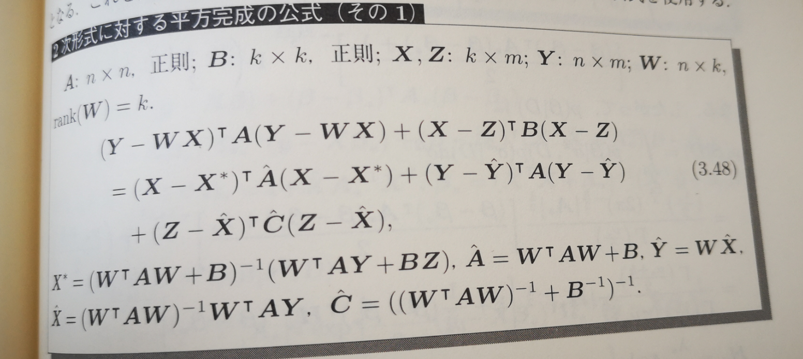

```{r setup, include=FALSE}
knitr::opts_chunk$set(echo = TRUE)
```

## 自然共役事前分布を用いたベイズ推定
<br />

### 自然共役事前分布とは？
<br />
<br />

教科書的（中妻,2019; p30）には「事前分布と事後分布が同じ分布型になる事前分布」。
<br />

事後分布の数式が自動的に求まるので便利であるとしています。
<br />
<br />

これだけでは、直感的な理解が難しいので、より具体的に考えていきましょう。
<br />
<br />

同時事後分布の確率密度関数（線形回帰モデル）は
<br />

$$ 
\begin{eqnarray}
f(\,\alpha^{*},\beta^{*},\sigma^{*}\,|\,Data\,) &=& \frac{ \overbrace{\,f(\,Data\,|\,\alpha^{*},\beta^{*},\sigma^{*}\,)}^{尤度} \cdot \overbrace{f(\,\alpha^{*},\beta^{*},\sigma^{*}\,)}^{事前分布}}{\underbrace{f(Data)}_{周辺尤度}}\\ 
\\
&=& \frac{f(\,Data\,|\,\alpha^{*},\beta^{*},\sigma^{*}\,) \cdot f(\,\alpha^{*},\beta^{*},\sigma^{*}\,)}{\int_{-\infty}^{\infty}\int_{-\infty}^{\infty}\int_{-\infty}^{\infty} \,f(\,Data\,|\,\alpha,\beta,\sigma\,) \cdot f(\,\alpha,\beta,\sigma\,)\,\,d\alpha\,d\beta\,d\sigma}
\end{eqnarray}
$$
<br />
<br />

周辺尤度 $f(Data)=\int\int\int\,f(\,Data\,|\,\alpha,\beta,\sigma\,) \cdot f(\,\alpha,\beta,\sigma\,)\,\,d\alpha\,d\beta\,d\sigma$ は事後分布の確率密度関数が積分して1になるために必要です。　→　**正規化定数 (Normalization Constant)** と呼ばれます。
<br />
<br />

したがって、正規化定数は事後分布が確率の公理を満たすために必要であるといえます。
<br />
<br />

一方で、この正規化定数が存在するがゆえに、事後確率密度の計算に積分計算が含まれ、解析的な導出を不可能にしています。
<br />

→　もしカーネル(尤度×事前分布)だけで積分して1になる (=確率の公理を満たす) なら、この積分を含む正規化定数 $f(Data)$ は不要です。&emsp;(あるいはカーネルに知っている定数を掛けるだけで)
<br />
<br />

個人的には、**自然共役事前分布（Conjugated Prior）**　はこのような「カーネル×知っている定数」が積分して1になるような事前分布(尤度と相性がいい事前分布)と理解しました。
<br />

つまり「カーネル×知っている定数」がそのまま(同時)事後分布になってくれるような事前分布ということです。
<br />

(逆に言うと正規化定数 $f(Data)$が知っている定数になるということ)
<br />
<br />

**数式による解釈イメージ**
<br />

知っている定数 $C$ を導入すると、
<br />

$$ 
\begin{eqnarray}
\underbrace{f(\,\alpha^{*},\beta^{*},\sigma^{*}\,|\,Data\,)}_{事後分布} &=& \frac{ \overbrace{\,f(\,Data\,|\,\alpha^{*},\beta^{*},\sigma^{*}\,)}^{尤度} \cdot \overbrace{f(\,\alpha^{*},\beta^{*},\sigma^{*}\,)}^{事前分布}}{\int_{-\infty}^{\infty}\int_{-\infty}^{\infty}\int_{-\infty}^{\infty} \,f(\,Data\,|\,\alpha,\beta,\sigma\,) \cdot f(\,\alpha,\beta,\sigma\,)}\\ 
\\
&=& \frac{Kernel}{\int_{-\infty}^{\infty}\int_{-\infty}^{\infty}\int_{-\infty}^{\infty} \,f(\,Data\,|\,\alpha,\beta,\sigma\,) \cdot f(\,\alpha,\beta,\sigma\,)\,\,d\alpha\,d\beta\,d\sigma}\\
\\
&=& C \cdot Kernal \\
\\
&\,& \int_{-\infty}^{\infty} (C \cdot Kernel) \,d\alpha\,d\beta\,d\sigma = 1
\end{eqnarray}
$$
<br />

$\int_{-\infty}^{\infty} (C \cdot Kernel) \,d\alpha\,d\beta\,d\sigma = 1$ なので、$C$ をかけるだけで正規化が終了
<br />

→　ややこしい $\int_{-\infty}^{\infty}\int_{-\infty}^{\infty} \,f(\,Data\,|\,\alpha,\beta,\sigma\,) \cdot f(\,\alpha,\beta,\sigma\,)\,\,d\alpha\,d\beta\,d\sigma$ を計算・評価する必要がない

<br />
<br />

（こうした特徴の他に、追加的な条件？なのかは分かりませんが、自然共役事前分布では、同時事後分布から周辺事後分布や
それらの期待値/中央値などが求まる必要があります）
<br />
<br />


### 線形回帰モデル
<br />
<br />

真のモデル
<br />

$$
Y_i = \alpha^{true} + \beta^{true} X_i + u_i \quad,\quad u_i \sim Normal\,(0,{\sigma^{true}}^2)
$$
を考えます。
<br />
<br />

中妻(2019) p.78によるとこのモデルのパラメータの自然共役事前分布は
<br />

$$ 
\begin{eqnarray}
\alpha,\beta\,|\,\sigma^2 &\sim& \boldsymbol{Normal_2} \left(
\begin{pmatrix}
\alpha_0 \\
\beta_0 \\
\end{pmatrix}_,\, 
\sigma^2\begin{pmatrix}
s_{\alpha}^2 & 0 \\
0 & s_{\beta}^2 \\
\end{pmatrix}
\right)
\\
\\
\sigma^2&\sim& InverseGamma \left( \,\frac{\nu_0}{2},\frac{\lambda_0}{2} \right)
\end{eqnarray}
$$
<br />

です。
<br />
<br />

$\alpha,\beta$ は２次元の多変量正規分布、$\sigma^2$ は逆ガンマ分布に、それぞれ従っています。
<br />

（ $\alpha_0,\beta_0,s_{\alpha}^2,s_{\beta}^2,\nu_0,\lambda_0$ はハイパーパラメータ（事前分布のパラメータ）で任意の値で問題ないです。）
<br />

（逆ガンマ分布のパラメータ $\nu_0,\lambda_0$ はそれぞれ、shape parameter、scale(rate) parameter と呼ばれます）
<br />


逆ガンマ分布の確率密度関数はこんな感じです。
```{r,echo=FALSE, warning=FALSE, message=FALSE}
library(pscl) 　#ベイズ統計のパッケージらしいです
x <- seq(0.1,8,0.1)
curve(densigamma(x, alpha=5, beta=10), from=0.1, to=8, lwd=3)
curve(densigamma(x, alpha=5, beta=20), from=0.1, to=8, lwd=3, lty=2, add=T)
```

<br />

この(同時)事前分布の最大のポイントは、$\alpha,\beta$ の事前分布が $\sigma^2$ の条件付き確率分布になっていることです。
<br />

$\alpha,\beta$ の事前分布の分散パラメータが、$\sigma^2$ の値に依存してしまっていることが分かると思います。やや厳しい仮定です。
<br />
<br />

事前分布の同時確率密度関数は、
<br />

$$
\begin{eqnarray}
f(\alpha,\beta,\sigma^2) &=& f(\alpha_,\beta\,|\,\sigma^2) \,\cdot\, f(\sigma^2)\\
\\
f(\alpha_,\beta\,|\,\sigma^2) &=& \frac{1}{\sqrt{2\pi\sigma^2s_{\alpha}^2}} \, \exp\left\{-\frac{(\alpha-\alpha_0)^2}{2{\sigma^2s_{\alpha}^2}}\right\}\,\cdot\,
\frac{1}{\sqrt{2\pi\sigma^2s_{\beta}^2}} \, \exp\left\{-\frac{(\beta-\beta_0)^2}{2{\sigma^2s_{\beta}^2}}\right\}\\
&=& \frac{1}{2\pi\sigma^2s_{\alpha}s_{\alpha}}  \, \exp\left\{-\frac{s_{\beta}^2(\alpha-\alpha_0)^2+s_{\alpha}^2(\beta-\beta_0)^2}{2{\sigma^2s_{\alpha}^2s_{\beta}^2}}\right\}\\
\\
f(\sigma^2) &=& \frac{\left(\frac{\lambda_0}{2}\right)^\frac{\nu_0}{2}}{\Gamma(\frac{\nu_0}{2})}(\sigma^2)^{-\left(\frac{\nu_0}{2}+1\right)}\,\cdot\,\exp\left(-\frac{\lambda_0}{2\sigma^2}\right)
\end{eqnarray}
$$
<br />

と書けます。
<br />
<br />

一方、尤度は、
<br />

$$
f((x_1,y_1),(x_2,y_2),\,...\, ,(x_N,y_N)\,|\,\alpha,\beta,\sigma) = \prod_{i=0}^{N}\frac{1}{\sqrt{2\pi\sigma^2}} \, \exp\left[-\frac{\{y_i-(\alpha+\beta x_i)\}^2}{2\sigma^2}\right]
$$
<br />

と書けます。

<br />
<br />


### 行列による線形回帰モデル推定

<br />
<br />


今後、要素表記だと式展開が煩雑すぎるので、以下の行列・ベクトルを導入します(サンプルサイズ$N$ で、変数の数を$K$を増やします)。

<br />
<br />


**モデル**
<br />

$$
\begin{eqnarray}
\boldsymbol{y} = 
\begin{pmatrix}
y_1\\ y_2\\ \vdots\\ y_N\\
\end{pmatrix}_, \quad
\boldsymbol{X} = 
\begin{pmatrix}
1 & x_{1,1} & x_{1,2} & \ldots & x_{1,K}\\
1 & x_{2,1} & x_{2,2} & \ldots & x_{2,K}\\
\vdots & \vdots & \vdots & \ddots & \vdots\\
1 & x_{N,1} & x_{N,2} & \ldots & x_{N,K}\\
\end{pmatrix}_, \quad
\boldsymbol{\beta} = 
\begin{pmatrix}
\alpha \\
\beta_1 \\
\vdots \\
\beta_K
\end{pmatrix}_,\ \ \
\boldsymbol{u} = \begin{pmatrix}
u_1 \\
u_2 \\
\vdots \\
u_N \\
\end{pmatrix}_,\ \ \
\boldsymbol{0} = 
\begin{pmatrix}
0 \\
0 \\
\vdots \\
0 \\
\end{pmatrix}_,\ \ \
\sigma^2\boldsymbol{I} = 
\begin{pmatrix}
\sigma^2 & 0 & \ldots & 0\\
0 & \sigma^2 & \ldots & 0\\
\vdots & \vdots & \ddots & \vdots\\
0 & 0 & \ldots & \sigma^2\\
\end{pmatrix}
\end{eqnarray}
$$
$$
\begin{eqnarray}
\underbrace{\boldsymbol{y}}_{(N × 1)} = \overbrace{\underbrace{\boldsymbol{X}}_{(N × K)} 
\cdot \underbrace{\boldsymbol{\beta}}_{(K × 1)}}^{(N × 1)} + \underbrace{\boldsymbol{u}}_{(N × 1)} \quad,\quad \boldsymbol{u} \sim \boldsymbol{MultiNorm}_{N}\,(\underbrace{\boldsymbol{0}}_{(N × 1)},\underbrace{\sigma^2\boldsymbol{I}}_{(N × N)})
\end{eqnarray}
$$
整理すると
<br />

$$
\begin{eqnarray}
\begin{pmatrix}
y_1\\
y_2\\
\vdots\\
y_N\\
\end{pmatrix}
=\begin{pmatrix}
\,\alpha\, + \,\beta_1 x_{1,1}\, + \,\beta_2 x_{1,2}\, + \,\ldots\, + \,\beta_K x_{1,K}\, +\,u_1\\
\,\alpha\, + \,\beta_1 x_{2,1}\, + \,\beta_2 x_{2,2}\, + \,\ldots\, + \,\beta_K x_{2,K}\, +\,u_1\\
\vdots\\
\,\alpha\, + \,\beta_1 x_{N,1}\, + \,\beta_2 x_{N,2}\, + \,\ldots\, + \,\beta_K x_{N,K}\, +\,u_N\\
\end{pmatrix}_,\\
\\
\begin{pmatrix}
u_1\\
u_2\\
\vdots\\
u_N\\
\end{pmatrix}
\sim \boldsymbol{MultiNorm}_{N}\,\left(
\begin{pmatrix}
0\\
0\\
\vdots\\
0\\
\end{pmatrix}_,
\begin{pmatrix}
\sigma^2 & 0 & \ldots & 0\\
0 & \sigma^2 & \ldots & 0\\
\vdots & \vdots & \ddots & \vdots\\
0 & 0 & \ldots & \sigma^2\\
\end{pmatrix}
\right)
\end{eqnarray}
$$
<br />
<br />

**事前分布**
<br />

$$
\begin{eqnarray}
\boldsymbol{\beta_0} = \begin{pmatrix}
\alpha_0 \\
\beta_{01} \\
\vdots \\
\beta_{0K}
\end{pmatrix}_,\ \ \
\boldsymbol{A_0}^{-1} = \begin{pmatrix}
a_{00} & a_{01} & \ldots & a_{0k}\\
a_{10} & a_{11} & \ldots & a_{1k}\\
\vdots & \vdots & \ddots & \vdots\\
a_{K0} & a_{K1} & \ldots & a_{K2} \\
\end{pmatrix}
\end{eqnarray}
$$
$$
\begin{eqnarray}
\boldsymbol{\beta}\,|\sigma^2 &\sim& \boldsymbol{MultiNorm}_{K+1}\,\left(\boldsymbol{\beta_0},\sigma^2\boldsymbol{A_0}^{-1}\right)\\
\\
\sigma^2 &\sim& InverseGamma \left( \,\frac{\nu_0}{2},\frac{\lambda_0}{2} \right)
\end{eqnarray}
$$
<br />

要素表記でのモデル同様、$\boldsymbol{\beta}$ の事前分布の分散パラメータが、$\sigma^2$ の値に依存してしまっていることが分かると思います。

<br />

$\boldsymbol{\beta}$ の事前分布の分散共分散行列が $\sigma^2\boldsymbol{A_0}^{-1}$ と逆行列の形になっていることに注意してください。逆行列を取らない $\boldsymbol{A_0}$ は「精度行列」と呼ばれます。これは後々出てくる条件付き事後分布の表現を簡単にするための工夫です。また、対角成分以外（共分散）は通常0になると思います。

<br />

同時事前分布は
<br />

$$
\begin{eqnarray}
f(\boldsymbol{\beta},\sigma^2) &=& f(\boldsymbol{\beta}\,|\,\sigma^2)\,\cdot f(\sigma^2)\\
\\
f(\boldsymbol{\beta}\,|\,\sigma^2) &=& (2\pi\sigma^2)^{-\frac{K+1}{2}}|\boldsymbol{A_0}|^{\frac{1}{2}}\exp\left[-\frac{1}{2\sigma^2}(\boldsymbol{\beta} - \boldsymbol{\beta_0})^T\boldsymbol{A_0}\,(\boldsymbol{\beta} - \boldsymbol{\beta_0})\right]\\
\\
f(\sigma^2) &=& \frac{\left(\frac{\lambda_0}{2}\right)^\frac{\nu_0}{2}}{\Gamma(\frac{\nu_0}{2})}(\sigma^2)^{-\left(\frac{\nu_0}{2}+1\right)}\,\cdot\,\exp\left(-\frac{\lambda_0}{2\sigma^2}\right)
\end{eqnarray}
$$
<br />

**尤度**
$$
f(\,\boldsymbol{y}\,|\,\boldsymbol{X},\boldsymbol{\beta},\sigma^2\,) = (2\pi\sigma^2)^{-\frac{N}{2}} \exp\left[-\frac{1}{2\sigma^2} (\boldsymbol{y} - \boldsymbol{X}\boldsymbol{\beta})^T(\boldsymbol{y} - \boldsymbol{X}\boldsymbol{\beta})\right]
$$
<br />
<br />

では事前分布と尤度が出そろったのでカーネルの計算に移りましょう。
<br />
<br />

$$
\begin{eqnarray}
Kernel &=& f(\,\boldsymbol{y}\,|\,\boldsymbol{X},\boldsymbol{\beta},\sigma^2\,) \,\cdot f(\,\boldsymbol{\beta},\sigma^2\,)\\
\\
&=& f(\,\boldsymbol{y}\,|\,\boldsymbol{X},\boldsymbol{\beta},\sigma^2\,) \,\cdot f(\,\boldsymbol{\beta}\,|\,\sigma^2\,)\,\cdot f(\sigma^2)\\
\\
&=& (2\pi\sigma^2)^{-\frac{N}{2}} \exp\left[-\frac{1}{2\sigma^2} (\boldsymbol{y} - \boldsymbol{X}\boldsymbol{\beta})^T(\boldsymbol{y} - \boldsymbol{X}\boldsymbol{\beta})\right] \cdot (2\pi\sigma^2)^{-\frac{K+1}{2}}|\boldsymbol{A_0}|^{\frac{1}{2}}\exp\left[-\frac{1}{2\sigma^2}(\boldsymbol{\beta} - \boldsymbol{\beta_0})^T\boldsymbol{A_0}\,(\boldsymbol{\beta} - \boldsymbol{\beta_0})\right]\\
&\cdot& \frac{\left(\frac{\lambda_0}{2}\right)^\frac{\nu_0}{2}}{\Gamma(\frac{\nu_0}{2})}(\sigma^2)^{-\left(\frac{\nu_0}{2}+1\right)}\,\cdot\,\exp\left(-\frac{\lambda_0}{2\sigma^2}\right)\\
\\
&=& \underbrace{(2\pi)^{-\frac{N+K+1}{2}}|\boldsymbol{A_0}|^{\frac{1}{2}}\cdot\frac{\left(\frac{\lambda_0}{2}\right)^\frac{\nu_0}{2}}{\Gamma(\frac{\nu_0}{2})}}_{定数m_1}\cdot(\sigma^2)^{-(\frac{N+K+\nu_0+1}{2}+1)}\exp\left[-\frac{1}{2\sigma^2}\left\{(\boldsymbol{y} - \boldsymbol{X}\boldsymbol{\beta})^T(\boldsymbol{y} - \boldsymbol{X}\boldsymbol{\beta}) + (\boldsymbol{\beta} - \boldsymbol{\beta_0})^T\boldsymbol{A_0}\,(\boldsymbol{\beta} - \boldsymbol{\beta_0}) + \lambda_0\right\}\right]\\
\\
\frac{1}{m_1}Kernel &=& (\sigma^2)^{-(\frac{N+K+\nu_0+1}{2}+1)}\exp\left[-\frac{1}{2\sigma^2}\left\{(\boldsymbol{y} - \boldsymbol{X}\boldsymbol{\beta})^T(\boldsymbol{y} - \boldsymbol{X}\boldsymbol{\beta}) + (\boldsymbol{\beta} - \boldsymbol{\beta_0})^T\boldsymbol{A_0}\,(\boldsymbol{\beta} - \boldsymbol{\beta_0}) + \lambda_0\right\}\right]\\
\end{eqnarray}
$$
<br />

ここで右辺 $\exp$ の｛｝内に関して、以下の行列の2次形式の平方完成の公式を用います。
<br />



<br />
<br />

$$
\begin{eqnarray}
&\,&(\boldsymbol{y} - \boldsymbol{X}\boldsymbol{\beta})^T(\boldsymbol{y} - \boldsymbol{X}\boldsymbol{\beta}) + (\boldsymbol{\beta} - \boldsymbol{\beta_0})^T\boldsymbol{A_0}\,(\boldsymbol{\beta} - \boldsymbol{\beta_0}) + \lambda_0\\
\\
&=& (\boldsymbol{\beta} - \boldsymbol{\beta_*})^T\boldsymbol{A_*}\,(\boldsymbol{\beta} - \boldsymbol{\beta_*}) +(\boldsymbol{y} - \boldsymbol{\hat{y}})^T(\boldsymbol{y} - \boldsymbol{\hat{y}}) + (\boldsymbol{\beta_0} - \boldsymbol{\hat\beta})^T \boldsymbol{C_*} (\boldsymbol{\beta_0} - \boldsymbol{\hat\beta})+ \lambda_0\\
\\
\end{eqnarray}
$$
ただし、
$$
\begin{eqnarray}
\boldsymbol{\beta_*} &=& (\boldsymbol{X}^T\boldsymbol{X}+\boldsymbol{A_0})^{-1}(\boldsymbol{X}^T\boldsymbol{y}+\boldsymbol{A_0\beta_0}), \quad
\boldsymbol{A_*}=\boldsymbol{X}^T\boldsymbol{X}+\boldsymbol{A_0},\quad\\\\
\boldsymbol{\hat\beta} &=& (\boldsymbol{X}^T\boldsymbol{X})^{-1}\boldsymbol{X}^T\boldsymbol{y}, \quad
\boldsymbol{\hat{y}}=\boldsymbol{X}\boldsymbol{\hat\beta}, \quad
\boldsymbol{C_*}=((\boldsymbol{X}^T\boldsymbol{X})^{-1}+\boldsymbol{A_0}^{-1})^{(-1)}
\end{eqnarray}
$$
以上より、
$$
\begin{eqnarray}
\frac{1}{m_1}Kernel &=& (\sigma^2)^{-(\frac{N+K+\nu_0+1}{2}+1)}\exp\left[-\frac{1}{2\sigma^2}\left\{(\boldsymbol{y} - \boldsymbol{X}\boldsymbol{\beta})^T(\boldsymbol{y} - \boldsymbol{X}\boldsymbol{\beta}) + (\boldsymbol{\beta} - \boldsymbol{\beta_0})^T\boldsymbol{A_0}\,(\boldsymbol{\beta} - \boldsymbol{\beta_0}) + \lambda_0\right\}\right]\\
\\
&=& (\sigma^2)^{-(\frac{N+K+\nu_0+1}{2}+1)}\exp\left[-\frac{1}{2\sigma^2}\left\{(\boldsymbol{\beta} - \boldsymbol{\beta_*})^T\boldsymbol{A_*}\,(\boldsymbol{\beta} - \boldsymbol{\beta_*}) +(\boldsymbol{y} - \boldsymbol{\hat{y}})^T(\boldsymbol{y} - \boldsymbol{\hat{y}}) + (\boldsymbol{\beta_0} - \boldsymbol{\hat\beta})^T \boldsymbol{C_*} (\boldsymbol{\beta_0} - \boldsymbol{\hat\beta})+ \lambda_0\right\}\right]\\
\\
&=& (\sigma^2)^{-\frac{K+1}{2}}\exp\left[-\frac{1}{2\sigma^2}(\boldsymbol{\beta} - \boldsymbol{\beta_*})^T\boldsymbol{A_*}\,(\boldsymbol{\beta} - \boldsymbol{\beta_*})\right]\cdot(\sigma^2)^{-(\frac{N+\nu_0}{2}+1)}\exp\left[-\frac{(\boldsymbol{y} - \boldsymbol{\hat{y}})^T(\boldsymbol{y} - \boldsymbol{\hat{y}}) + (\boldsymbol{\beta_0} - \boldsymbol{\hat\beta})^T \boldsymbol{C_*} (\boldsymbol{\beta_0} - \boldsymbol{\hat\beta})+ \lambda_0}{2\sigma^2}\right]
\end{eqnarray}
$$
さらに
$$
\begin{eqnarray}
\nu_* &=& N+\nu_0\\
\\
\lambda_* &=& (\boldsymbol{y} - \boldsymbol{\hat{y}})^T(\boldsymbol{y} - \boldsymbol{\hat{y}}) + (\boldsymbol{\beta_0} - \boldsymbol{\hat\beta})^T \boldsymbol{C_*} (\boldsymbol{\beta_0} - \boldsymbol{\hat\beta})+ \lambda_0
\end{eqnarray}
$$
とすると、
$$
\begin{eqnarray}
\frac{1}{m_1}Kernel &=&(\sigma^2)^{-\frac{K+1}{2}}\exp\left[-\frac{1}{2\sigma^2}(\boldsymbol{\beta} - \boldsymbol{\beta_*})^T\boldsymbol{A_*}\,(\boldsymbol{\beta} - \boldsymbol{\beta_*})\right]\cdot(\sigma^2)^{-(\frac{\nu_*}{2}+1)}\exp\left[-\frac{\lambda_*}{2\sigma^2}\right]\\
\\
\underbrace{(2\pi)^{-\frac{k+1}{2}}|\boldsymbol{A_*}|^{\frac{1}{2}}\cdot\frac{\left(\frac{\lambda_*}{2}\right)^\frac{\nu_*}{2}}{\Gamma(\frac{\nu_*}{2})}}_{定数}\cdot\frac{1}{m_1}Kernel &=& (2\pi)^{-\frac{k+1}{2}}|\boldsymbol{A_*}|^{\frac{1}{2}}\cdot\frac{\left(\frac{\lambda_*}{2}\right)^\frac{\nu_*}{2}}{\Gamma(\frac{\nu_*}{2})}\cdot
(\sigma^2)^{-\frac{K+1}{2}}\exp\left[-\frac{1}{2\sigma^2}(\boldsymbol{\beta} - \boldsymbol{\beta_*})^T\boldsymbol{A_*}\,(\boldsymbol{\beta} - \boldsymbol{\beta_*})\right]\cdot(\sigma^2)^{-(\frac{\nu_*}{2}+1)}\exp\left[-\frac{\lambda_*}{2\sigma^2}\right]\\
\\
&=&\underbrace{\overbrace{(2\pi\sigma^2)^{-\frac{k+1}{2}}|\boldsymbol{A_*}|^{\frac{1}{2}}\exp\left[-\frac{1}{2\sigma^2}(\boldsymbol{\beta} - \boldsymbol{\beta_*})^T\boldsymbol{A_*}\,(\boldsymbol{\beta} - \boldsymbol{\beta_*})\right]}^{\boldsymbol{MultiNorn(\boldsymbol{\beta_*},\sigma^2\boldsymbol{A_*}^{-1})}の確率密度関数}\overbrace{\frac{\left(\frac{\lambda_*}{2}\right)^\frac{\nu_*}{2}}{\Gamma(\frac{\nu_*}{2})}\cdot
(\sigma^2)^{-(\frac{\nu_*}{2}+1)}\exp\left[-\frac{\lambda_*}{2\sigma^2}\right]}^{InverseGamma(\frac{\nu_*}{2},\frac{\lambda_*}{2})の確率密度関数}}_{同時事後確率密度関数}
\end{eqnarray}
$$
<br />
<br />

以上の展開により、カーネルに「知っている定数」をかけていくだけで、積分して1になる同時事後確率密度関数が手に入ることが明らかになりました。
<br />
<br />

よって、事後分布は
<br />

$$
\begin{eqnarray}
\boldsymbol{\beta}\,|\,\sigma^2,\boldsymbol{X},\boldsymbol{y} &\sim& \boldsymbol{MultiNorm}_{K+1}\,\left(\boldsymbol{\beta_*},\sigma^2\boldsymbol{A_*}^{-1}\right)\\
\\
\sigma^2\,|\boldsymbol{X},\boldsymbol{y} &\sim& InverseGamma \left( \,\frac{\nu_*}{2},\frac{\lambda_*}{2} \right)
\end{eqnarray}
$$
<br />

$\boldsymbol{\beta}$ については、$\sigma^2$　で条件付けらえた条件付き事後分布になっているため、周辺事後分布を得るためには、同時事後確率密度関数を $\sigma^2$ で積分する必要があります。

<br />
<br />

計算は割愛しますが、積分の結果、$\boldsymbol{\beta}$ の周辺事後分布は多変量T分布であることが分かります。

$$
\begin{eqnarray}
\boldsymbol{\beta}\,|\,\boldsymbol{X},\boldsymbol{y} &\sim& \boldsymbol{MultiT}_{K+1}\,\left(\nu_*,\boldsymbol{\beta_*},\boldsymbol{H_*}\right)
,\quad \boldsymbol{H_*}=\frac{\lambda_*}{\nu_*}\boldsymbol{A_*}^{(-1)}\\
\\
\sigma^2\,|\boldsymbol{X},\boldsymbol{y} &\sim& InverseGamma \left( \,\frac{\nu_*}{2},\frac{\lambda_*}{2} \right)
\end{eqnarray}
$$
<br />
<br />

また個々の係数も単変量T分布に従うことが明らかにされています。
<br />
<br />

回帰係数 $\boldsymbol{\beta}$ のベイズ事後推定は（事後平均、事後中央値、事後最頻値は全て同じ値になる）,$\boldsymbol{A_0}=\tau_o\boldsymbol{I}$
とすると
<br />

$$
\boldsymbol{\beta_*}=(\boldsymbol{X}^T\boldsymbol{X}+\tau_o\boldsymbol{I})^{-1}\boldsymbol{X}^T\boldsymbol{y}
$$
<br />

となるから、リッジ回帰推推定量(ハイパーパラメータが$\tau_0$のケース)と等しくなります。
<br />
<br />

事後平均値（EAP; 解析解）
<br />

$$ 
E(\,\boldsymbol{\beta}\,|\,\boldsymbol{X},\boldsymbol{y}) = \boldsymbol{\beta_*}\,,\quad 
E(\,\sigma^2\,|\,\boldsymbol{X},\boldsymbol{y}) = \frac{\frac{\lambda_*}{2}}{\frac{\nu_*}{2} - 1}  
$$

<br />
<br />

```{r GS_sampling_conjugate_LR}
library(MASS)
library(invgamma)
library(ggplot2)
library(GGally)

gs_conp_linreg <- function(y,X,iterations,b0,A0,nu0,lam0){
  
  ## y は被説明変数のベクトル
  ## X は説明変数の行列（行:サンプル、列:変数）
  ## iterations は乱数発生の個数・回数
  ## b0,A0 はそれぞれ beta の事前分布の平均と精度行列(分散共分散行列の逆行列)
  ## nu0,lam0 はそれぞれ sigma^2 の事前分布の shape parameter と scale parameter
  
  n <-  nrow(X)　　　　　　　 ## サンプルサイズnは行列Xの行数
  k <-  ncol(X) - 1　　　　　 ## 変数(係数)の数kは行列Xの列数-1
  XX <-  t(X) %*% X           ## X^T*X
  Xy <-  t(X) %*% y           ## X^T*y
  b_hat <- solve(XX) %*% Xy   ## (X^T*X)^-1*X^T*y, solve()は逆行列を計算する関数
  y_hat <- X %*% b_hat 
  A0b0 <- A0 %*% b0           ## A0b0
  nu_star <- n + nu0          ## n + nu0 
  C_star <- solve(solve(XX) + solve(A0)) ## C_star = ((X^T*X)^(-1) + A0^(-1))^(-1)
  A_star <-  solve(XX + A0)   ## A_star = (X^T*X + A0)^(-1) 
  b_star <- (solve(XX + A0)) %*% (Xy + A0b0) 　　## betaの条件付き事後確率分布の平均
  
  
  lam_star <- t(y - y_hat) %*%  (y - y_hat) + t(b0 - b_hat) %*% C_star %*% (b0 - b_hat) + lam0 
  ## sigma^2の条件付き事後確率分布のscale parameterの2倍の値
  
  mean_sigma2 <- (lam_star/2)/((nu_star/2) - 1) ## sigma^2 の事後分布の期待値（解析解）
  ## E(sigma^2) = scale_parameter/(shape_parameter - 1)
  
  runs <- matrix(0,nrow=iterations,ncol=(k+2)) ## 発生した乱数を格納する行列
  
  sigma2 <- (t(y - (X %*% b_hat))) %*% (y - (X %*% b_hat)) / (n - k - 1)
  sigma2 <- as.numeric(sigma2)
  ## sigma^2の初期値発生（step1）
  ## 何でもよいけど、収束の早さを見込んで、OLSの残差からsigma^2を推定
  
  for (idx in 1:iterations){
    
    b <- mvrnorm(mu=b_star,Sigma=sigma2*A_star)        ## beta の乱数発生（step2） from Multi-variate Normal
    sigma2 <- rinvgamma(n=1, rate=lam_star/2, shape=nu_star/2)      ## sigma^2 の乱数発生（step3）from Inverse Gamma
    
    runs[idx,1:(k+1)] <- b          ## 発生した beta を格納
    runs[idx,(k+2)] <- sigma2　 ## 発生した sigma^2 を格納
    
  }
  
  result <- list(runs,rbind(b_star,mean_sigma2))
  return(result)
}

```

<br />
<br />

```{r simulation}

set.seed(45)
N <- 50
K <- 2

#　説明変数は2個
alpha <- 1
beta_1 <- 2
beta_2 <- -1

u <- rnorm(N,sd=0.7) # 誤差項

x1 <- runif(N,min=-sqrt(3),max=sqrt(3)) # x1
x2 <- runif(N,min=-sqrt(3),max=sqrt(3)) # x2

# y と X を作る
y <- alpha + beta_1 * x1 + beta_2 * x2 + u
X <- cbind(1,x1,x2)


# 事前分布の設定
b0 <- rep(0,K+1)
A0 <- 0.2 * diag(K+1) ## 0.2*(3×3 単位行列), beta の事前分布の精度行列
sd0 <- sqrt(diag(solve(A0))) ##　beta の事前分布の分散
nu0 <- 5
lam0 <- 7

x_prior = seq(-3,3,0.01)

#事前分布の形状確認

curve(dnorm(x,mean=0,sd=5),-5,5,ylim=c(0,0.1),main="prior of alpha,beta_1,beta_2")
curve(dinvgamma(x, rate=lam0/2, shape=nu0/2),0,1.5,ylim=c(0,1),main="prior of sigma^2")

#iterationの設定
warmup <- 2000
n_samplings <- 20000
iter　<-　warmup + n_samplings 

gs_sampling <- gs_conp_linreg(y,X,iter,b0,A0,nu0,lam0)

#トレースプロット
ts.plot(gs_sampling[[1]][,1])
ts.plot(gs_sampling[[1]][,2])
ts.plot(gs_sampling[[1]][,3])
ts.plot(gs_sampling[[1]][,4])

#ヒストグラム
hist(gs_sampling[[1]][,1])
hist(gs_sampling[[1]][,2])
hist(gs_sampling[[1]][,3])
hist(gs_sampling[[1]][,4])

#事後平均と事後中央値
print(colMeans(gs_sampling[[1]][warmup:iter,]))
print(apply(gs_sampling[[1]][warmup:iter,], 2, median))

#解析解
print(gs_sampling[[2]])


#visualize
ggpairs(as.data.frame(gs_sampling[[1]]))　#散布図行列

gs_sampling_df <- as.data.frame(cbind(1:22000,gs_sampling[[1]]))　#dfにする
colnames(gs_sampling_df) <- c("t","alpha","beta_1","beta_2","sigma^2")

#散布図（全体）
ggplot(gs_sampling_df,aes(x=alpha,y=beta_1,colour=t)) + geom_point() + 
  scale_color_gradient2(low  = "red",high = "blue", midpoint=1000) 

#散布図（warmupのみ）
ggplot(gs_sampling_df[1:2000,],aes(x=alpha,y=beta_1,colour=t)) + geom_point() +
  scale_color_gradient(low = "blue", high = "red")

```


### 以下、成分表記によるカーネルの展開（平方完成の前までしかできませんでした。）

カーネルは、
<br />

$$
\begin{eqnarray}
Kernel &=& f((x_1,y_1),(x_2,y_2),\,...\, ,(x_N,y_N)\,|\,\alpha,\beta,\sigma)\,\cdot\,f(\alpha,\beta,\sigma^2) \\
\\
&=& \prod_{i=0}^{N}\frac{1}{\sqrt{2\pi\sigma^2}} \, \exp\left[-\frac{\{y_i-(\alpha+\beta x_i)\}^2}{2\sigma^2}\right]\,\cdot\, \frac{1}{2\pi\sigma^2s_{\alpha}s_{\alpha}}  \, \exp\left\{-\frac{s_{\beta}^2(\alpha-\alpha_0)^2+s_{\alpha}^2(\beta-\beta_0)^2}{2{\sigma^2s_{\alpha}^2s_{\beta}^2}}\right\}\\
&\cdot& \,\frac{\left(\frac{\lambda_0}{2}\right)^\frac{v_0}{2}}{\Gamma\left(\frac{v_0}{2}\right)}(\sigma^2)^{-\left(\frac{v_0}{2}+1\right)}\,\cdot\,\exp\left(-\frac{\lambda_0}{2\sigma^2}\right)\\
\\
&=& \underbrace{\frac{\left(\frac{\lambda_0}{2}\right)^\frac{v_0}{2}}{\Gamma\left(\frac{v_0}{2}\right)}
 \,(2\pi)^{-\frac{N+2}{2}} \,\frac{1}{s_\alpha s_\beta}}_{=定数K}\,\cdot\,(\sigma^2)^{-\left(\frac{N+v_0}{2}+2\right)}\cdot\exp\left[-\frac{1}{2\sigma^2} \left[\Sigma_{i=1}^{N}\{y_i-(\alpha+\beta x_i)\}^2 + \frac{s_{\beta}^2(\alpha-\alpha_0)^2+s_{\alpha}^2(\beta-\beta_0)^2}{s_{\alpha}^2s_{\beta}^2}+\lambda_0 \right]\right] 
\end{eqnarray}
$$
定数Kで割ってしまいます。


